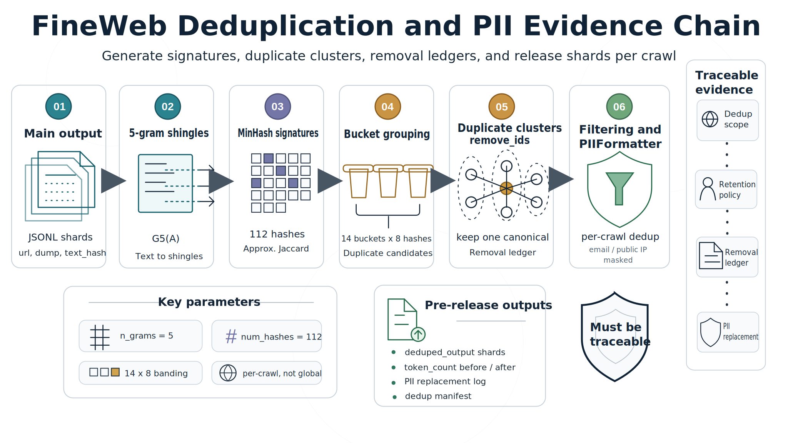
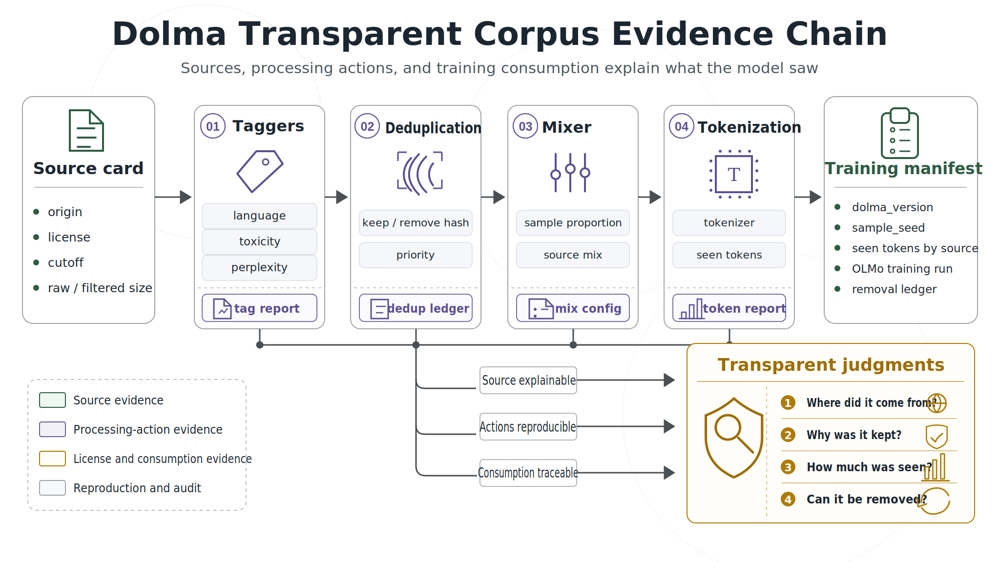
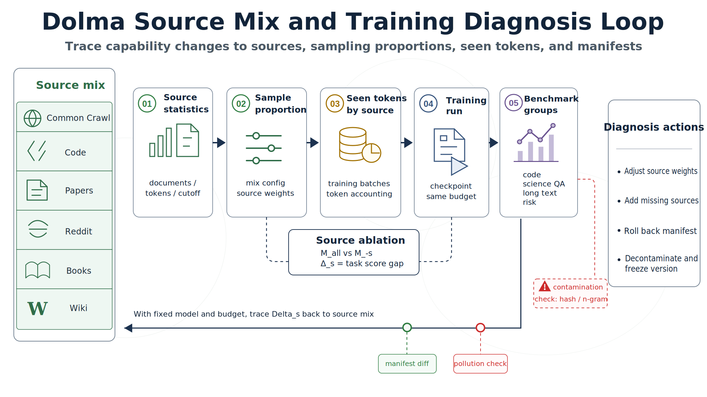

# Chapter 38: Text Corpus Data Engineering: Open Web, Filtering, Deduplication, and Transparent Ledgers

<div class="chapter-authors">Guanlin Mu; Xuhong Cao</div>

## Abstract

This chapter uses FineWeb and Dolma as complementary cases to explain how text-corpus data engineering turns open Web snapshots into trainable, traceable, and diagnosable data assets. FineWeb emphasizes Common Crawl extraction, filtering, deduplication, privacy processing, and processing-choice evaluation. Dolma emphasizes source ledgers, token consumption, source ablation, and transparent release. Together they show that pre-training corpora are not defined by scale alone, but by provenance, processing, versions, evidence chains, and reproducibility conditions.

## Keywords

text corpora; open Web; FineWeb; Dolma; filtering and deduplication; transparent ledger; pre-training data

## Case A: FineWeb: Open Web Text Corpora, Filtering, Deduplication, and Processing Choices

### Case A: Learning Objectives

After completing this chapter, readers should be able to:

- Distinguish Common Crawl WARC files, WET text files, extracted Web-page text, filtered FineWeb documents, and the final token stream.
- Explain why FineWeb re-extracts text from WARC instead of directly using Common Crawl WET text.
- Understand the data-engineering roles of `WarcReader`, `URLFilter`, `Trafilatura`, `LanguageFilter`, `GopherRepetitionFilter`, `GopherQualityFilter`, `C4QualityFilter`, `FineWebQualityFilter`, `MinhashDedup*`, and `PIIFormatter` in the official FineWeb processing script.
- Design a Web pre-training document schema that allows each sample to be traced to its source, filters, deduplication state, token statistics, and privacy-processing status.
- Compare different data-processing strategies under fixed model scale, fixed token budget, fixed evaluation sets, and repeated random seeds.
- Identify copyright, privacy, removal, evaluation-contamination, and cross-lingual transfer boundaries when adapting FineWeb-style processing to enterprise or research projects.

### Case A: Opening Scenario

A team is preparing to train an English foundation model at the 7B-parameter scale. The first data plan is straightforward: download recent Common Crawl WET files, filter non-English pages, run simple deduplication, and send the text into the tokenizer. Offline samples look decent: many pages are indeed natural language, and the token volume is large enough. The team starts small-model pre-training, but after several weeks it encounters three hard-to-explain problems.

First, the model does not improve stably on several commonsense tasks as training progresses. When the team inspects training snippets, it finds that many texts are actually Web menus, footers, cookie banners, SEO keyword lists, and automatically generated on-site recommendations. Second, the same classes of template pages repeatedly appear across months and sites. Training loss seems stable, but model outputs become increasingly prone to repeating templated short phrases. Third, the legal team asks the data team to locate samples from a particular domain and suspected email addresses, but the data team can only fuzzy-search already shuffled token shards; it cannot reconstruct which crawl dump and URL a text came from, which filters it passed, or whether it was retained after deduplication.

These three problems show that Common Crawl is a Web snapshot, not a training set. The real data-engineering task is not to "download more Web pages," but to transform each Web sample into a traceable, filterable, deduplicable, evaluable, and removable training record. FineWeb is a public case study built around exactly this problem.

### Case A.1: Common Crawl Is a Web Snapshot, Not a Training Corpus

Common Crawl WARC files preserve the original responses captured during Web crawling, including HTML, request metadata, and page structure. WET files are Common Crawl's extracted text version. For pre-training data engineering, WET is attractive: it avoids HTML parsing cost and has a size closer to the text needed for model training. However, FineWeb's experiments found that directly using WET leaves too much boilerplate, menu text, and page noise, so FineWeb re-extracts main text from WARC.

#### Case A.1.1 Processing Layers from Web Snapshot to Training Text

At least five transformation layers separate Web snapshots from training text.

The first layer is URL-level filtering. Some domains, paths, or subword patterns carry high risk by themselves, such as malicious sites, adult-content sites, or obvious spam pages. The official FineWeb dataset card places URL filtering at the first step of the pipeline, using block lists and subword detection to remove documents from malicious and NSFW websites.

The second layer is main-text extraction. An HTML page is not the main text; navigation, footers, scripts, recommendation lists, and advertisements may all be mixed into it. FineWeb uses Trafilatura to extract main text from raw WARC HTML, and the paper compares WARC+Trafilatura with WET through ablation experiments.

The third layer is language identification. FineWeb is an English corpus, so it uses FastText language filtering and retains documents whose English score reaches a threshold. The official dataset card states that FineWeb removes documents whose `en` language score is below 0.65.

The fourth layer is quality filtering. Web text commonly contains repeated n-grams, abnormal line lengths, too many short lines, list-like pages, and formatting errors. FineWeb combines Gopher repetition and quality filters, part of the C4 filters, and FineWeb-specific filters to control these problems.

The fifth layer is deduplication and privacy processing. FineWeb performs MinHash deduplication independently within each crawl and uses `PIIFormatter` during public release to anonymize email addresses and public IP addresses.

Together, these steps are not merely a collection of cleaning scripts, but a set of pre-training data contracts. Each step should have inputs, outputs, failure records, and reviewable parameters.

#### Case A.1.2 Filtering Strength Determines the Training Signal

Web-corpus cleaning most easily produces two opposite errors.

If filtering is too weak, the model absorbs templates, garbled text, advertisements, duplicate pages, and non-natural language. These may contribute many tokens statistically, but they do not help downstream tasks and may even damage the language distribution. If filtering is too strict, corpus size drops, content coverage narrows, and some long-tail knowledge, forum Q&A, and non-standard writing may be mistakenly removed. For pre-training, a filter is not better simply because it is stricter; it must find a verifiable balance between preserving the token budget and improving the training signal.

This trade-off can be described with a simple training-utility function:

$$
U(F)=S_{eval}(D_F)-\lambda \cdot R_{risk}(D_F)-\mu \cdot \max(0, T_{target}-T_F)
$$

Here, $F$ denotes the filtering strategy, $D_F$ is the filtered dataset, $S_{eval}$ is the model score under a fixed evaluation protocol, $R_{risk}$ is privacy, copyright, toxicity, and contamination risk, $T_F$ is the retained token count, and $T_{target}$ is the lower token bound required by the training budget. This is not an original formula from the FineWeb paper; it is an engineering abstraction of the FineWeb experimental logic: when selecting filters, one cannot look only at whether samples appear "clean"; one must also evaluate whether the model improves under a fixed training budget and whether risk decreases.

### Case A.2: FineWeb Data Definition and Public Form

FineWeb is publicly available as a full dataset, configurations split by Common Crawl dump, and smaller sample versions. The official dataset card states that users can load the full dataset or specify a particular crawl/dump; dump names follow the `CC-MAIN-(year)-(week number)` format. Sample versions include random subsets of approximately 350B, 100B, and 10B GPT-2 tokens, enabling researchers to reproduce experiments or debug processing code at lower cost.

*Table 38-1 Public FineWeb Forms and Engineering Uses*

| Form | Public Description | Engineering Use | Usage Notes |
| --- | ---: | --- | --- |
| FineWeb full dataset | The initial paper reports 15T tokens; the official dataset card continues listing later dumps | Large-scale English Web pre-training, data ablation, filtering-strategy research | The data continues to update; cite the dataset-card access time and scale convention |
| Per-dump config | Organized as `CC-MAIN-YYYY-WW` | Sampling by time window, reproducing experiments, locating distribution shifts | Different dumps differ in site coverage and quality; do not assume identical distributions |
| `sample-350BT` | Approximately 350B GPT-2 tokens | Medium-scale data experiments, deduplication and filtering validation | Suitable for larger ablations, but not equivalent to full FineWeb |
| `sample-100BT` | Approximately 100B GPT-2 tokens | Prototype training, quick evaluation, cost-constrained experiments | Record sampling source and randomness |
| `sample-10BT` | Approximately 10B GPT-2 tokens | Pipeline debugging, field checks, read/write performance tests | Not suitable for final data-quality conclusions |

Sources: Hugging Face FineWeb dataset card download configurations, sample-version descriptions, and dump naming convention; initial scale reported by the FineWeb paper.

#### Case A.2.1 Task Definition

FineWeb's task is not to annotate supervised-learning labels, but to build a pre-training token stream for autoregressive language models. Given a collection of Common Crawl Web snapshots $C=\{c_i\}$, the goal is to learn a data-processing function:

$$
P_\theta: C \rightarrow D=\{d_j\}
$$

Each output document $d_j$ should at least include extracted text, source metadata, language information, token statistics, filtering status, and deduplication status. The tokenizer then maps the document collection into training sequences:

$$
\tau(D)=\left[x_1,x_2,\ldots,x_N\right]
$$

The standard pre-training objective remains minimizing next-token negative log likelihood:

$$
\mathcal{L}(\theta)=-\sum_{t=1}^{N}\log p_\theta(x_t|x_{<t})
$$

FineWeb focuses on the part before this objective function: how to choose $P_\theta$ so that, under the same model, the same training tokens, and the same evaluation sets, the resulting model is better.

FineWeb leaves engineering teams with three main judgments. The first concerns main-text extraction. WET text is already "text," but not necessarily "trainable main text." FineWeb's replacement of WET with WARC+Trafilatura shows that text extraction itself must be treated as a core variable affecting model capability.

The second concerns deduplication granularity. Global deduplication appears more thorough, but FineWeb's ablation results show that running global MinHash deduplication across all crawls is not necessarily better; independent per-crawl deduplication performs more strongly. This reminds data-engineering teams that the goal of deduplication is not to remove the maximum possible repetition, but to remove repetition that harms training.

The third concerns filter validation. FineWeb does not choose filters solely from manual rules. Instead, it trains multiple data-ablation models and compares scores on fixed evaluation sets. Filter thresholds, C4-rule choices, and custom heuristics are determined through training validation.

### Case A.3: Key Fields in FineWeb Document Records

The official FineWeb dataset card states that samples include `language`, `language_score`, and `token_count` annotations, derived respectively from the language filter and GPT-2 tokenizer statistics. When reproducing a FineWeb-like pipeline inside an enterprise, processing status, provenance, deduplication, and risk fields should also be retained. Otherwise, when training results become abnormal, it is impossible to determine whether the issue came from extraction, filtering, deduplication, or sampling.

*Table 38-2 FineWeb-like Web Document Record Schema*

| Field Group | Typical Fields | Source or Generation Method | Engineering Use |
| --- | --- | --- | --- |
| Provenance fields | `url`, `dump`, `warc_record_id`, `fetch_time` | WARC metadata and reader supplements | Trace original Web pages, locate crawls, respond to removals |
| Text fields | `text`, `raw_html_hash`, `text_hash` | Trafilatura extraction and hash computation | Support training reads, extraction-quality checks, and precise location |
| Language fields | `language`, `language_score` | FastText `LanguageFilter` | Control English-corpus boundary and diagnose language-identification errors |
| Quality fields | `gopher_flags`, `c4_flags`, `fineweb_flags` | Gopher, C4, and FineWeb filters | Explain why a sample was retained or removed |
| Dedup fields | `minhash_signature`, `dedup_cluster_id`, `dedup_keep` | MinHash deduplication stage | Control near-duplicates and review removed samples |
| Statistics fields | `token_count`, `char_count`, `line_count` | `TokensCounter` and document statistics | Estimate training budget and analyze filtering impact |
| Privacy fields | `pii_email_replaced`, `pii_ip_replaced` | `PIIFormatter` | Record email and public-IP anonymization status |

Fields such as `gopher_flags`, `c4_flags`, and `fineweb_flags` are field groups added by the author to explain the engineering structure; they do not imply that the official FineWeb dataset card publishes each of these columns. The official annotations explicitly published by FineWeb include `language`, `language_score`, and `token_count`.

#### Case A.3.1 A Sample Cannot Store Only `text`

The following is an abstract FineWeb-like document record. It is not an original FineWeb sample; it is an engineering example organized from the FineWeb dataset card and the DataTrove pipeline.

```json
{
  "id": "CC-MAIN-2023-50/segment-x/warc-record-y",
  "url": "https://example.org/article",
  "dump": "CC-MAIN-2023-50",
  "text": "<main text extracted by Trafilatura>",
  "language": "en",
  "language_score": 0.94,
  "token_count": 1267,
  "filters": {
    "url_filter": "kept",
    "gopher_repetition": "kept",
    "gopher_quality": "kept",
    "c4_quality": "kept",
    "fineweb_quality": "kept"
  },
  "dedup": {
    "method": "minhash",
    "scope": "per_dump",
    "ngram": 5,
    "buckets": 14,
    "hashes_per_bucket": 8,
    "keep": true
  },
  "pii": {
    "email_formatted": true,
    "public_ip_formatted": true
  }
}
```

This example illustrates the basic idea of a FineWeb-like corpus: `text` is the training entry point, but by itself it cannot explain sample quality. What supports review is the combination of provenance, language score, filtering status, deduplication scope, and privacy-processing records.

#### Case A.3.2 Relationship Between Schema and Training Evaluation

FineWeb does not evaluate individual samples directly; it evaluates data versions generated by processing strategies. Let a processing version $v$ correspond to dataset $D_v$, which is used to train model $M_v$. If the evaluation suite is $B=\{b_1,\ldots,b_k\}$ and each task score is $s(M_v,b_i)$, an aggregate score can be defined as:

$$
S(M_v)=\frac{1}{k}\sum_{i=1}^{k}s(M_v,b_i)
$$

The FineWeb paper compares data versions using fixed models, fixed training tokens, fixed evaluation tasks, repeated random samples, and different initialization seeds. In engineering practice, each data version should further record its processing manifest:

$$
Manifest(v)=\{code\_commit, dump\_set, filter\_params, dedup\_params, tokenizer, sample\_seed\}
$$

Without this manifest, even if the evaluation script is reproduced, one cannot reproduce "which exact data version was trained."

### Case A.4: FineWeb's Code-based Processing Flow

One important feature of FineWeb is that its processing pipeline has a public script. `examples/fineweb.py` in the DataTrove repository states that it is used to process and create the FineWeb dataset. The script has two major parts: first, it performs the main processing for each dump; then it applies MinHash deduplication and PII formatting to the processed output.

#### Case A.4.1 Main Processing Pipeline

The main processing pipeline can be abstracted in the following order. Class names come from the DataTrove FineWeb example script; explanations are organized by this chapter.

*Table 38-3 Key Modules in the FineWeb Main Processing Pipeline*

| Order | DataTrove Module | Input | Output | Role |
| ---: | --- | --- | --- | --- |
| 1 | `WarcReader` | Common Crawl WARC segments | Raw HTML document stream | Reads Web snapshots from `s3://commoncrawl/crawl-data/.../warc/` |
| 2 | `URLFilter` | URL and raw document | Retained or removed documents | Removes sources matching malicious, NSFW, or block-list patterns |
| 3 | `Trafilatura` | Raw HTML | Extracted main text | Reduces menu, footer, and page-template noise |
| 4 | `LanguageFilter` | Text | English document stream and non-English exclusion logs | Retains documents whose English score reaches the threshold |
| 5 | `GopherRepetitionFilter` | English text | Repetition-pattern filtering result | Removes repeated n-grams and abnormally repetitive content |
| 6 | `GopherQualityFilter` | Text statistics | Quality-filtering result | Applies MassiveText/Gopher-style quality rules |
| 7 | `C4QualityFilter` | Text statistics | C4-rule filtering result | Applies the subset of C4 rules adopted by FineWeb |
| 8 | `FineWebQualityFilter` | Text statistics | Custom-filtering result | Removes list-like, repeated-line, and abnormal-newline documents |
| 9 | `JsonlWriter` | Retained documents | JSONL shards | Writes documents entering the deduplication stage |

Sources: imported modules and main-processing pipeline in DataTrove `examples/fineweb.py`; FineWeb dataset card data-processing steps.

The code structure of the main processing stage can be summarized as:

```python
pipeline = [
    WarcReader(common_crawl_warc_path),
    URLFilter(...),
    Trafilatura(favour_precision=True),
    LanguageFilter(...),
    GopherRepetitionFilter(...),
    GopherQualityFilter(...),
    C4QualityFilter(...),
    FineWebQualityFilter(...),
    JsonlWriter(base_processing_output)
]
```

This is conceptual pseudocode used to explain the module order in the FineWeb example script. Real parameters, log directories, S3 paths, task counts, and Slurm resource configurations should follow the DataTrove repository script.

#### Case A.4.2 Deduplication and Privacy-processing Pipeline

FineWeb uses MinHash for approximate deduplication. The goal of MinHash is to estimate the Jaccard similarity between two documents. If documents $A$ and $B$ are represented as sets of 5-grams, their similarity is:

$$
J(A,B)=\frac{|G_5(A)\cap G_5(B)|}{|G_5(A)\cup G_5(B)|}
$$

MinHash approximates this similarity with multiple hash functions. The FineWeb paper states that its deduplication parameters are 5-grams and 112 hash functions, split into 14 buckets with 8 hashes per bucket; if the 8 MinHash values in any bucket match, the pair is considered a duplicate candidate. The `MinhashConfig` in the DataTrove example script also corresponds to `n_grams=5`, `num_buckets=14`, and `hashes_per_bucket=8`.



*Figure 38-1 FineWeb MinHash deduplication and PII-processing flow. Source: original illustration based on Hugging Face DataTrove `examples/fineweb.py` and the FineWeb dataset card.*

#### Case A.4.3 FineWeb's Per-crawl Deduplication Judgment

Intuitively, global deduplication seems more thorough: put all 96 crawls together and remove all near-duplicate documents. FineWeb's ablation experiments, however, produce the opposite signal. The paper describes a key phenomenon: when global deduplication is performed from the newest crawls toward older crawls, older crawls are heavily removed; in one older snapshot, the retained 10% of the data is actually worse than the removed 90%, containing more advertisements, keyword lists, and abnormally formatted text. FineWeb ultimately chooses to run MinHash deduplication independently for each crawl.

This result matters for engineering practice. Deduplication is not mathematically better simply because it is more exhaustive; what matters is how it changes the data distribution. Global deduplication can alter the time distribution, site coverage, and duplicate-cluster structure across old and new crawls in complex ways. If one looks only at "how much duplication was removed," valuable samples may be removed while low-quality long-tail samples remain.


*Figure 38-2 FineWeb data-processing-choice ablation loop. Source: original illustration based on FineWeb paper Section 3.1.*

### Case A.5: Evaluating FineWeb Data-processing Choices

FineWeb's evaluation method differs from a typical dataset introduction. It treats data-processing steps as experimental variables and trains ablation models to compare different data versions. The paper states that ablation models keep model parameters, architecture hyperparameters, training token count, and training steps consistent. To reduce random-sampling effects, each data version is used to train two models with different random subsets and different initialization seeds, and their average scores are compared.

#### Case A.5.1 Fixed Variables

FineWeb's evaluation protocol can be summarized in Table 38-4.

*Table 38-4 FineWeb Data-ablation Evaluation Protocol*

| Control Item | FineWeb Paper Practice | Data-engineering Meaning |
| --- | --- | --- |
| Model scale | Ablation model has 1.82B parameters and Llama architecture | Prevents model-scale changes from hiding data differences |
| Tokenizer | GPT-2 tokenizer | Fixes token-statistics convention |
| Training budget | Filtering ablations use about 28B tokens; some deduplication and cumulative-improvement experiments use 350B tokens | Separates quick screening from high-cost validation |
| Repeated experiments | Two models per data version, with different random subsets and initialization seeds | Reduces sampling and initialization noise |
| Training framework | Nanotron | Fixes training implementation |
| Evaluation framework | lighteval | Fixes evaluation implementation |
| Evaluation tasks | CommonSense QA, HellaSwag, OpenBook QA, PIQA, SIQA, WinoGrande, ARC, MMLU | Uses multitask signals to evaluate data-processing effects |

Source: FineWeb paper Section 3.1, Experimental setup.

If data version $v$ is trained twice, producing models $M_{v,1}$ and $M_{v,2}$, and each model is evaluated on $k$ tasks, the version score can be written as:

$$
\bar{S}_v=\frac{1}{2k}\sum_{r=1}^{2}\sum_{i=1}^{k}s(M_{v,r},b_i)
$$

This formula is also an engineering expression of the FineWeb evaluation protocol. It emphasizes that the evaluation object is not a single sample, but a data version generated by a processing strategy.

Filters cannot be decided once based only on rule intuition. FineWeb's filter selection can be divided into three steps.

First, build baseline filtering. After extracting text from WARC, FineWeb first applies URL block lists, English language identification, and Gopher/MassiveText-style quality filtering. The paper reports that after applying these baseline steps to WARC-extracted text from 96 snapshots, the result is about 36T GPT-2 tokens.

Second, compare existing rules. When studying C4 rules, FineWeb finds that the terminal-punctuation rule alone brings a clear improvement but removes about 30% of tokens. FineWeb ultimately adopts a subset of C4 rules excluding terminal punctuation, because it removes less data and yields a more suitable training benefit.

Third, design custom filters. FineWeb collects more than 50 document-level and cross-document statistical indicators, compares distributions between "higher-quality" and "lower-quality" data, chooses thresholds that distinguish the two, and validates them with 28B-token ablation runs. The adopted custom filters focus on three issues: low ratio of lines ending in punctuation, high ratio of repeated-line characters, and abnormal ratio of short lines.

#### Case A.5.2 Common Failures and Repair Actions

FineWeb's experience can be converted into an error-attribution table for Web pre-training corpora. This is not an official FineWeb table, but an engineering retrospective organized by this chapter from the FineWeb paper and dataset card.

*Table 38-5 Common Failures and Repair Actions for FineWeb-like Web Corpora*

| Error Type | Symptom | Possible Root Cause | Data-engineering Repair Action |
| --- | --- | --- | --- |
| Page-template residue | Model repeats menus, footers, or cookie text | Direct WET usage or poor main-text extraction | Return to WARC, re-extract with Trafilatura or similar tools, and sample-check template residue |
| Non-English mixing | Multilingual garbling and mixed scripts appear during English-model training | Loose language threshold or untreated mixed-language paragraphs | Preserve `language_score`, sample by score buckets, and apply paragraph-level filtering if needed |
| Oversized duplicate clusters | Loss appears stable but downstream tasks do not improve | Template sites, mirrored sites, cross-month repetition | Use MinHash deduplication and record duplicate clusters and deduplication scope |
| Global deduplication hurts distribution | Model does not improve after large deletion of older crawl content | Global deduplication changes time and quality distributions | Compare per-crawl and global deduplication under a fixed training budget |
| Overly strict filters | Token scale drops and long-tail knowledge is removed | A single rule removes too many tokens | Record token-removal rate per filter and decide thresholds through ablation |
| Residual privacy samples | Emails, public IPs, or other identifiable information enter release data | Missing PII processing or false negatives | Use `PIIFormatter` or similar rules and record replacement strategy and boundaries |

### Case A.6: Usage Boundaries of Public Web Corpora

FineWeb is a strong public case for open Web pre-training corpus engineering, but it should not be understood simply as "all Web text that can be used directly for commercial training." Public datasets, open code, and the ODC-By license reduce the barrier to research reproduction, but they do not automatically remove copyright, privacy, safety, or removal responsibilities in the user's jurisdiction, business scenario, or downstream model release.

FineWeb is suitable for English foundation-model pre-training, Web-data filtering research, deduplication-strategy ablations, debugging DataTrove-like large-scale text-processing pipelines, and teaching version governance for pre-training corpora. It is especially suitable for answering questions such as "does a particular data-processing step make the model better," because the public materials provide code, dataset cards, paper ablations, and evaluation protocols.

FineWeb is not suitable for answering all training-data questions across all languages, domains, and compliance environments. It mainly consists of English Web content from Common Crawl; it is not equivalent to Chinese corpora, professionally licensed corpora, medical/legal/financial corpora, or SFT/preference data for conversational assistants.

When enterprises reproduce the FineWeb idea, the most valuable transferable pieces are not fixed thresholds, but four engineering objects.

First, processing code should be versioned. `code_commit`, filter parameters, tokenizer, sampling seed, and dump list should all enter the manifest. Second, filters should have exclusion logs. Ideally, every deleted sample can explain which rule deleted it. Third, deduplication should preserve scope and parameters. Per-dump, per-domain, and global deduplication have different effects; it is not enough to record only "deduplicated." Fourth, evaluation must fix variables. If model architecture, training tokens, training steps, evaluation sets, and random seeds are not fixed, conclusions about data processing are not comparable.

FineWeb should not be used as an unreviewed commercial training corpus. Commercial models still require license, robots/terms, data-removal, privacy, and sensitive-content reviews. FineWeb should also not be treated as the only standard for a "high-quality English corpus." Its quality definition comes from fixed ablation models and a set of academic benchmarks, which do not necessarily cover helpfulness, safety, factual freshness, or instruction-following needs in real products.

For Chinese or multilingual training, one cannot directly copy FineWeb's English FastText threshold, English tokenizer statistics, or assumptions about English page formats. Migration requires recalibrating language identification, simplified/traditional Chinese handling, site templates, domain distributions, low-quality-page rules, and evaluation tasks.

### Case A: Summary

FineWeb clarifies an often underestimated issue: a Web pre-training corpus is not the result of downloading Common Crawl; it is a data asset jointly formed by code, filters, deduplication strategy, evaluation protocol, and release documentation. This chapter's core conclusions are threefold.

First, Web main-text extraction is a model-capability variable. FineWeb re-extracts text from WARC with Trafilatura precisely because WET text can retain too much template and menu noise. Second, deduplication strategy must be validated through training results. FineWeb's experiments show that global MinHash deduplication is not necessarily better than independent per-crawl deduplication, and removing more duplicates does not equal obtaining better training data. Third, filter selection should enter a fixed evaluation protocol. Through isomorphic ablation models, fixed token budgets, lighteval evaluation, and repeated random seeds, FineWeb turns data-processing choices into reviewable engineering experiments.

For readers of this book, what is most worth learning from FineWeb is not copying a particular token scale, but turning pre-training corpus engineering into a traceable, reproducible, evaluable, and auditable system.

## Case B: Dolma: Transparent Pre-training Corpus Ledgers and Attributable Evaluation

### Case B: Learning Objectives

After completing this chapter, readers should be able to:

- Explain why open weights cannot substitute for training-data transparency.
- Read Dolma's versions, source statistics, sampling proportions, and ODC-BY usage boundaries.
- Distinguish the roles of document records, source cards, and training manifests in audits.
- Use token-accounting formulas to describe the relationship among raw tokens, filtered tokens, sample proportions, and seen tokens.
- Understand the evidence chain of transparent corpora through the four Dolma Toolkit actions: tag, dedup, mix, and tokenize.
- Design source ledgers, removal ledgers, contamination checks, and version-freezing mechanisms for internal enterprise pre-training corpora.

### Case B.1: Problem Scenario: Open Weights Still Cannot Explain the Model

Two teams obtain the same 7B open-model weights. The first team wants to continue pre-training the model to improve code and scientific-question-answering capabilities. The second team wants to analyze why the model gives outdated answers on several factual questions. The weights, inference code, and part of the evaluation scripts are downloadable, but they quickly encounter the same problem: no one can answer what data the model actually saw.

The continued-pretraining team needs to know how much code, papers, encyclopedic content, Web text, and social media were present in the original model corpus, so that it does not repeatedly oversample the same data types. The bias-analysis team needs to know whether certain Web pages, papers, forum discussions, or benchmark solutions entered training, so it can judge whether a problem comes from knowledge gaps, sampling weights, contamination, or model training itself. Without training corpora and processing records, every explanation remains guesswork.

Dolma is designed to solve exactly this problem. It turns an English pre-training corpus from an invisible data recipe into a set of downloadable, measurable, processable, removable, and auditable sources. OLMo is not a parallel protagonist in this chapter, but a downstream example of Dolma being consumed by a transparent training chain. It reminds us that open model research should not only open weights; it should open training data, processing tools, and evaluation code as far as possible.

#### Case B.1.1 Open-model Research Needs Data Evidence

"Open" has different levels. Releasing only weights allows users to run a model, but does not allow researchers to explain it. Releasing training code allows users to reproduce the training framework, but still does not explain what the model actually saw. Data transparency that supports scientific research must answer at least six classes of questions.

- Source: Does each document come from Common Crawl, code repositories, papers, books, encyclopedias, or social platforms?
- Version: What were the source acquisition time, processing-script version, and filtering rules?
- Scale: Are raw tokens, filtered tokens, sampled tokens, and seen tokens consistent?
- Contamination: Did evaluation sets, solutions, or customer test sets overlap with the training corpus?
- License: How do the dataset release license and original-source terms jointly constrain users?
- Removal: If a user requests removal of personal data, can the corresponding document be located and handled?

The Dolma dataset card directly reflects this design orientation: it lists versions, summary statistics, download methods, license information, and a personal-data removal entry point. The Dolma GitHub repository further provides data and tools, so transparency is not limited to paper descriptions.

For corpora like Dolma, the core object of transparency is a ledger; a single `text` field is not the only object. More important are three ledgers formed around `text`.

The first is the source ledger, recording where each data type comes from, how large it is, what cutoff date it uses, and how it was processed. The second is the processing ledger, recording how taggers, filters, deduplication strategies, mixers, and tokenizers changed raw documents. The third is the training ledger, recording which sources a training run actually sampled, what the sampling proportions were, and how seen tokens were distributed across training steps.

If these three ledgers are disconnected, transparency degrades into "downloadability." The data can be downloaded, but cannot explain the model; the model can be trained, but cannot be audited; versions can be updated, but cannot be compared.

### Case B.2: Dataset Overview: Versions, Scale, and Source Structure

Dolma is not a single static file, but a corpus asset with version evolution. The Hugging Face dataset card lists versions such as `v1`, `v1_5`, `v1_5-sample`, `v1_6`, `v1_6-sample`, and `v1_7`. Among them, `v1_7` is used to train OLMo 7B-v1.7 and introduces new sources, more quality filtering, and fuzzy deduplication.

*Table 38-6 Public Dolma Versions and Uses*

| Version | Release Date | Compressed Size | Dataset-card Description | Engineering Use |
| --- | --- | ---: | --- | --- |
| `v1` | 2023-08-18 | 6.0 TB | First Dolma release | Trace the earliest public corpus form |
| `v1_5` | 2023-10-31 | 6.4 TB | Used to train OLMo-1B, about 3T tokens | Review early OLMo training corpus |
| `v1_5-sample` | 2023-10-31 | 2.9 TB | Sample of about 1.9T tokens, used for OLMo-7B | Track training samples below full scale |
| `v1_6` | 2024-01-31 | 5.4 TB | Adds partial deduplication and repeated n-gram filtering on top of v1.5 | Study filtering and deduplication evolution |
| `v1_6-sample` | 2024-01-31 | 16.4 GB | Exploratory sample of about 10B tokens | Quick debugging and data browsing |
| `v1_7` | 2024-04-15 | 4.5 TB | Used to train OLMo 7B-v1.7, with new sources, more quality filtering, and fuzzy deduplication | Current default version and transparent-training reference |

Source: Versions section of the Hugging Face `allenai/dolma` dataset card.

#### Case B.2.1 v1.6 Source Structure

Dolma covers Web, code, papers, social media, books, and encyclopedic sources. To avoid mixing versions, Table 38-7 uses the coarse-grained statistics from the dataset card's v1.6 summary statistics. The v1.7 sources are more fine-grained, adding Refined Web, StarCoder, arXiv, StackExchange, Flan, OpenWebMath, Algebraic Stack, MegaWika, and other sources. Subsequent writing or experiments should explicitly state which version is used.

*Table 38-7 Dolma v1.6 Source Statistics*

| Source | Document Type | UTF-8 Bytes | Documents | Unicode Words | Llama Tokens |
| --- | --- | ---: | ---: | ---: | ---: |
| Common Crawl | web pages | 9,022 GB | 3,370M | 1,775B | 2,281B |
| The Stack | code | 1,043 GB | 210M | 260B | 411B |
| C4 | web pages | 790 GB | 364M | 153B | 198B |
| Reddit | social media | 339 GB | 377M | 72B | 89B |
| PeS2o | STEM papers | 268 GB | 38.8M | 50B | 70B |
| Project Gutenberg | books | 20.4 GB | 0.056M | 4.0B | 6.0B |
| Wikipedia and Wikibooks | encyclopedic | 16.2 GB | 6.2M | 3.7B | 4.3B |
| Total | mixed | 11,519 GB | 4,367M | 2,318B | 3,059B |

Source: Hugging Face `allenai/dolma` dataset card, Summary Statistics v1.6. GB, M, and B follow the dataset-card convention.

Table 38-7 should not be read only as a scale display. It reveals three engineering facts.

First, Dolma is a source mix, not a single Web dump. Common Crawl accounts for a large share, but code, papers, social media, books, and encyclopedic content all enter the corpus in different forms. Changes in model capability cannot be vaguely attributed to "more Web data."

Second, different statistical conventions serve different questions. UTF-8 bytes help estimate storage and processing cost, document count helps observe sample granularity, while Unicode words and Llama tokens are closer to the training budget. Mixing these conventions distorts discussions of data scale.

Third, versions cannot be directly compared without care. v1.6 and v1.7 differ in source decomposition, filtering rules, and sample proportions. If a model is trained with v1.7, one cannot explain its training behavior using only the v1.6 coarse table.

### Case B.3: Decomposing a Transparent Chain Through the Source Ledger

This section does not begin from an individual text, but from Dolma's source ledger to decompose the chain of a transparent pre-training corpus. The "sample" here is not an image or a question, but an evidence path from source to document and then to the training manifest.

#### Case B.3.1 From Source to Document

Dolma's task is not to annotate supervised labels for each text, but to make records consumed by training reconstructable. Let the source set be $S=\{s_1,\ldots,s_m\}$. Each source is processed by a function $P_s$ into a document set $D_s$:

$$
D_s=P_s(R_s, C_s)
$$

Here, $R_s$ is the raw source, and $C_s$ is the processing configuration for that source, including taggers, filters, deduplication strategy, sampling proportion, and tokenizer. The final training corpus is a mixture of multiple sources:

$$
D=\bigcup_{s \in S} Sample(D_s, r_s)
$$

Dolma's transparency lies in recording $S$, $R_s$, $C_s$, $r_s$, and version information as publicly as possible. Model training is no longer just "used three trillion tokens"; it can be traced to which sources contributed how much, how they were processed, and how they were sampled.

#### Case B.3.2 Token Accounting Should Track Actual Training Consumption

The easiest part of a multi-source corpus to misread is token scale. A source with many raw tokens does not necessarily contribute the same proportion during training; filtering, deduplication, sample proportion, and multiple epochs all change the final seen tokens.

The actual contribution of a source $s$ during training can be written as:

$$
T^{seen}_s = T^{filtered}_s \times r_s \times e_s
$$

where $T^{filtered}_s$ is the number of filtered tokens, $r_s$ is the sampling proportion, and $e_s$ is the epoch count or equivalent sampling count during training. The proportion of that source in the training mix is:

$$
p_s=\frac{T^{seen}_s}{\sum_j T^{seen}_j}
$$

The Dolma v1.7 dataset card lists both source token counts and sample proportions precisely so that users can distinguish "what is in the dataset" from "how much the model actually saw."

#### Case B.3.3 Three Ways to Read a Document

Transparent corpora do not end with packaging and uploading `text`. At least three layers of records are needed: an individual document record, a source card, and a training-version manifest. The document record supports training and location; the source card explains data origin and processing rules; the training manifest reproduces the data actually consumed by a model run.

*Table 38-8 Dolma-like Transparent Corpus Record Schema*

| Layer | Typical Fields | Source or Generation Method | Engineering Use |
| --- | --- | --- | --- |
| Document level | `id`, `source`, `text`, `text_hash` | Data reader and hash computation | Locate samples, deduplicate, read during training |
| Document level | `created_at`, `url_or_origin`, `license_hint` | Original source metadata | License review and time tracking |
| Document level | `language_tag`, `toxicity_tag`, `perplexity_score` | Dolma Toolkit taggers or custom taggers | Quality filtering and risk bucketing |
| Source level | `source_name`, `source_version`, `raw_size`, `filtered_size` | Source card and statistics scripts | Explain data composition |
| Source level | `dedup_policy`, `filter_config`, `sample_proportion` | Dolma mixer and processing configs | Reproduce source mix |
| Training level | `dolma_version`, `tokenizer`, `sample_seed`, `seen_tokens` | Training manifest | Reproduce experiments and explain metric changes |
| Governance level | `removal_status`, `known_limitations`, `release_constraints` | Dataset card and governance records | Handle removal, bias, and usage boundaries |

These fields are an engineering schema organized by the author from the Dolma dataset card, Dolma Toolkit documentation, and transparent-training audit needs. They do not imply that Dolma officially publishes each field exactly as listed.

The following is an abstract Dolma-like document record showing how a transparent corpus connects samples, sources, and training versions.

```json
{
  "id": "dolma-v1_7/common-crawl/doc-000001",
  "source": "Dolma's CC",
  "source_version": "v1_7",
  "text": "<document text>",
  "text_hash": "sha256:...",
  "tags": {
    "language": "en",
    "toxicity_bucket": "low",
    "perplexity_bucket": "normal"
  },
  "processing": {
    "tagger_config": "dolma-toolkit-config-x",
    "dedup_policy": "fuzzy_dedup",
    "sample_proportion": 0.5
  },
  "training_manifest": {
    "tokenizer": "OLMo tokenizer version",
    "dolma_version": "v1_7",
    "included_in_run": true
  }
}
```

This record cannot be read at only one layer. In Dolma, the document layer, source layer, and training layer must point back to one another. If a document has a `source` but no source card, it can locate a sample but cannot explain the origin. If a source card has statistics but no training manifest, it can explain what is in the dataset but not what the model actually saw. If a manifest has sampling proportions but no document hash, removal and contamination checks break.

### Case B.4: Dolma Toolkit Makes the Evidence Chain Executable

The Dolma GitHub repository states that Dolma is both a dataset and a toolkit. Dolma Toolkit supports single-machine, cluster, and cloud environments. It includes language detection, toxicity detection, perplexity scoring, and common filtering recipes such as Gopher, C4, and OpenWebText; its deduplication component uses a Rust Bloom filter for acceleration.

#### Case B.4.1 Four Actions Correspond to Four Kinds of Evidence

Dolma Toolkit documentation summarizes data organization as four actions: tag, dedup, mix, and tokenize. They are not isolated scripts, but evidence-chain generators: tag records document attributes, dedup records what is retained and removed, mix records sampling proportions, and tokenize records the token convention that enters training.

*Table 38-9 Dolma Toolkit Processing Actions and Evidence Outputs*

| Order | Action | Official Documentation Description | Evidence Output | Main Risk |
| ---: | --- | --- | --- | --- |
| 1 | Taggers | Assign language, toxicity, perplexity, and other attribute tags to document spans | Document quality labels and risk labels | Tagger-version changes alter filtering results |
| 2 | Deduplication | Deduplicate documents by content or metadata | Deduplication strategy, retention priority, deletion records | Cross-source deduplication changes source mix |
| 3 | Mixer | Remove, filter, or mix documents based on attribute values | Sample proportion, source mix, data version | Opaque sample proportions cause token-accounting errors |
| 4 | Tokenization | Use Hugging Face-compatible tokenizers | Token counts, tokenizer version, training stream | Tokenizer changes alter token counts and training budget |

Source: Dolma Toolkit documentation README.



*Figure 38-3 Dolma transparent-corpus evidence chain. Source: original illustration based on AllenAI Dolma Toolkit documentation.*

The boundary between toolchains and manual audits matters. A toolchain can stably generate statistics, tags, hashes, and manifests, but it cannot replace all audits. License boundaries, PII removal, evaluation contamination, and source representativeness still require human rules, sample review, or dedicated detection tasks.

This is also the difference between a Dolma-like transparent corpus and an ordinary "collection of cleaning scripts." Ordinary scripts only answer "what did I delete"; a transparent toolchain must also answer "why was it deleted, how did the post-deletion distribution change, did training actually benefit, and can it be removed later." If a processing action cannot leave interpretable evidence, it is hard for it to support transparent training.

### Case B.5: Evaluation Shifts from Highest Score to Attribution

The evaluation focus of transparent corpora is not the "highest score," but whether score changes can be explained. Dolma-like source-level corpora let model evaluation move beyond leaderboards and trace training logs back to sources, versions, and sampling proportions.

#### Case B.5.1 Source Ablation Locates Capability Sources

To judge whether a source affects model capability, one can run source ablation. Let full training produce model $M_{all}$, and training with source $s$ removed produce model $M_{-s}$. The average difference over task set $B$ is:

$$
\Delta_s=\frac{1}{|B|}\sum_{b \in B} \left[score(M_{all}, b)-score(M_{-s}, b)\right]
$$

When $\Delta_s$ changes clearly on code tasks, scientific QA, or long-context tasks, the data team can trace capability changes back to source mix instead of vaguely attributing them to "model parameters."



*Figure 38-4 Dolma source mix and training-diagnosis loop. Source: original illustration based on the Dolma dataset card and OLMo training use.*

#### Case B.5.2 Diagnosis Checklist

*Table 38-10 Dolma-like Transparent Corpus Evaluation and Diagnosis Table*

| Evaluation Question | Required Records | Metric or Evidence | Possible Action |
| --- | --- | --- | --- |
| Which source drives a capability | Source mix, sample proportion, seen tokens | Source ablation, task-score difference $\Delta_s$ | Adjust source weight or add data |
| Whether an evaluation set is contaminated | Document hash, n-gram index, eval-set hash | Overlap rate, contamination span | Remove contaminated samples and freeze a new version |
| Training loss fluctuates abnormally | Batch source records, tokenizer version | Source-specific loss, token distribution | Inspect sampler and source shards |
| Social-media risk increases | Toxicity tag, PII tag, source card | Risk-tag rate, manual sample review | Tighten filtering or reduce sampling proportion |
| Versions are incomparable | `dolma_version`, `filter_config`, `dedup_policy` | Manifest diff | Freeze version or rerun controlled experiments |

#### Case B.5.3 Common Failure Modes

*Table 38-11 Common Failures and Repair Actions for Dolma-like Transparent Corpora*

| Failure Mode | Symptom | Possible Root Cause | Governance Action |
| --- | --- | --- | --- |
| Source-mix drift | A task category suddenly regresses in a new version | Sample proportion or filtering rules changed | Compare manifest diff, roll back, or resample by strata |
| Inconsistent token accounting | Reported scale does not match training seen tokens | Raw, filtered, and sampled tokens are mixed | Report raw, filtered, sampled, and seen tokens together |
| Cross-source duplication | Paper abstracts, encyclopedia mirrors, or code fragments repeat | Deduplication only within source | Add cross-source deduplication and record retention priority |
| Evaluation contamination | Benchmark scores become abnormally high | Web or forum data contains questions and solutions | Build eval hash/n-gram decontamination index |
| Removal cannot be located | PII removal request cannot be handled | Missing source/id/hash mapping | Build removal ledger and shard reverse index |
| Ambiguous license boundary | ODC-BY is mistaken for authorization from original sources | Original source terms are ignored | Preserve original terms and restrictions in source cards |

These failure modes show that transparent-corpus quality is not only about whether text is clean. A transparent training sample must pass three kinds of checks simultaneously: whether the source is explainable, whether the processing actions are reproducible, and whether training consumption is traceable. Missing any one of these checks can turn data into a corpus that is public but not auditable.

### Case B.6: Reuse Boundaries of Transparent Corpora

Dolma is suitable for open language-model pre-training research, source-mix experiments, transparent data-governance teaching, training-data audit method validation, and internal enterprise manifest design. It is especially suitable for research questions such as "how does training data affect model capabilities and limitations," because it opens data, dataset cards, and processing tools together.

Dolma should not be understood as meaning that all sources are unconditionally usable for commercial purposes. The Hugging Face dataset card states that Dolma is released under ODC-BY, while users are still bound by the licenses and terms of use of the original data sources. In other words, Dolma's release license does not automatically erase the boundaries of Common Crawl, Reddit, code, papers, books, and other original sources.

Enterprises usually cannot publish training data, but they can transfer Dolma's transparency practices. A minimum viable version includes:

- Build a source card for each source, recording origin, version, license, acquisition time, filtering rules, and limitations.
- Freeze a manifest for each training version, recording source mix, sample proportion, tokenizer, `filter_config`, `dedup_policy`, and `sample_seed`.
- Build validation splits for major sources to support source-specific loss and source ablation.
- Build decontamination indexes for evaluation sets, customer test sets, and online issue repositories.
- Build a removal ledger so that URL, document id, or text hash can map to training shards.

At the same time, Dolma is not suitable as a direct quality standard for Chinese, multilingual, or vertical-industry corpora. It is primarily an English pre-training corpus. Migration to Chinese, medical, legal, or financial scenarios requires redefining sources, licenses, filters, and evaluation tasks. Dolma should also not be used to prove that open corpora are inherently safe. The meaning of transparency is that defects are visible, locatable, and repairable, not that defects do not exist.

### Case B: Summary

Dolma moves pre-training corpora from invisible data recipes toward auditable data assets. This chapter's core conclusions are threefold.

First, the basic unit of a transparent pre-training corpus is not a single `text` field, but a document record that connects source, processing configuration, sampling proportion, and training manifest. Second, source mix must be explained through token accounting rather than by reporting only raw scale. Third, the four Dolma Toolkit actions - tag, dedup, mix, and tokenize - provide a clear template for enterprises building reproducible training corpora internally.

For readers of this book, what is most transferable from Dolma is not a particular source or the three-trillion-token scale, but the way it leaves evidence for training data. Only when sources, processing actions, sampling proportions, training manifests, and governance records form a connected chain does a pre-training corpus have a foundation for continued research, error attribution, and long-term maintenance.

## Chapter Summary

FineWeb shows how open Web text is transformed from snapshots into training corpora, while Dolma shows how pre-training data becomes an interpretable asset through source ledgers and diagnostic protocols. Together, they define two main lines of text-corpus data engineering: filtering, deduplication, privacy processing, and training effect on one side; source structure, token ledgers, version transparency, and attributable evaluation on the other.

## References

Penedo, G., Kydlíček, H., Allal, L. B., Lozhkov, A., Mitchell, M., Raffel, C., von Werra, L., & Wolf, T. (2024). The FineWeb Datasets: Decanting the Web for the Finest Text Data at Scale. NeurIPS 2024 Datasets and Benchmarks Track. https://arxiv.org/abs/2406.17557.

Hugging Face. (2026). HuggingFaceFW/fineweb Dataset Card. https://huggingface.co/datasets/HuggingFaceFW/fineweb.

Hugging Face. (2026). DataTrove FineWeb Processing Script. https://github.com/huggingface/datatrove/blob/main/examples/fineweb.py.

Penedo, G., Kydlíček, H., Cappelli, A., Sasko, M., & Wolf, T. (2024). DataTrove large scale data processing. https://github.com/huggingface/datatrove.

Luccioni, S., & Viviano, J. (2021). What's in the Box? A Preliminary Analysis of Undesirable Content in the Common Crawl Corpus. https://arxiv.org/abs/2105.02732.

Soldaini, L., Kinney, R., Bhagia, A., Schwenk, D., Atkinson, D., Authur, R., et al. (2024). Dolma: an Open Corpus of Three Trillion Tokens for Language Model Pretraining Research. ACL 2024. https://arxiv.org/abs/2402.00159.

Allen Institute for AI. (2023). Ai2 Dolma: 3 trillion token open corpus for language model pretraining. https://allenai.org/blog/dolma-3-trillion-tokens-open-llm-corpus-9a0ff4b8da64.

AllenAI. (2026). allenai/dolma Dataset Card. https://huggingface.co/datasets/allenai/dolma.

AllenAI. (2026). Dolma Dataset and Toolkit Repository. https://github.com/allenai/dolma.

AllenAI. (2026). Dolma Toolkit Documentation. https://github.com/allenai/dolma/blob/main/docs/README.md.

Groeneveld, D., Beltagy, I., Walsh, P., Bhagia, A., Kinney, R., Tafjord, O., et al. (2024). OLMo: Accelerating the Science of Language Models. https://arxiv.org/abs/2402.00838.
