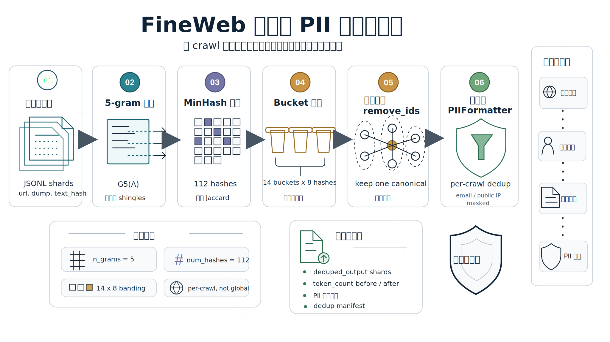
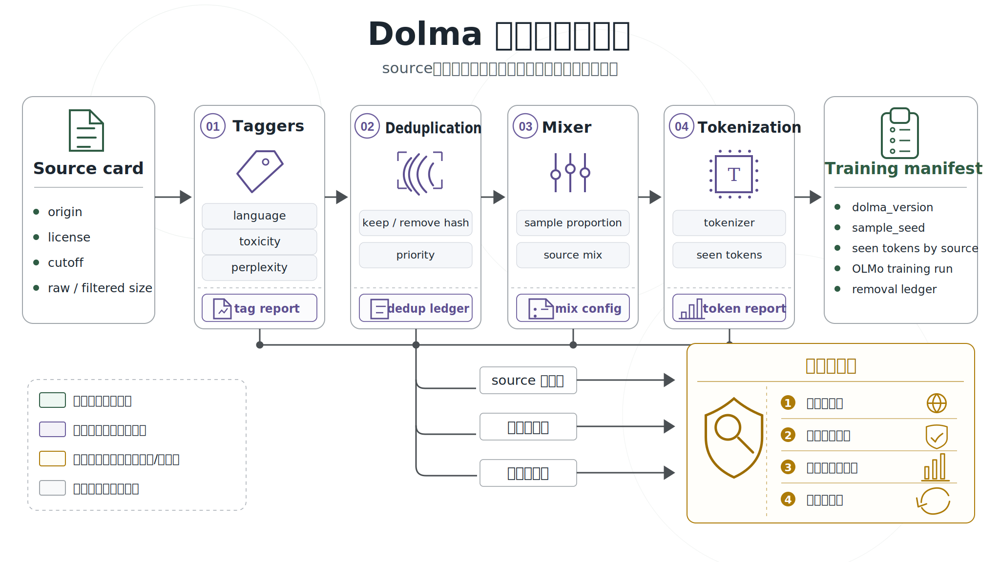
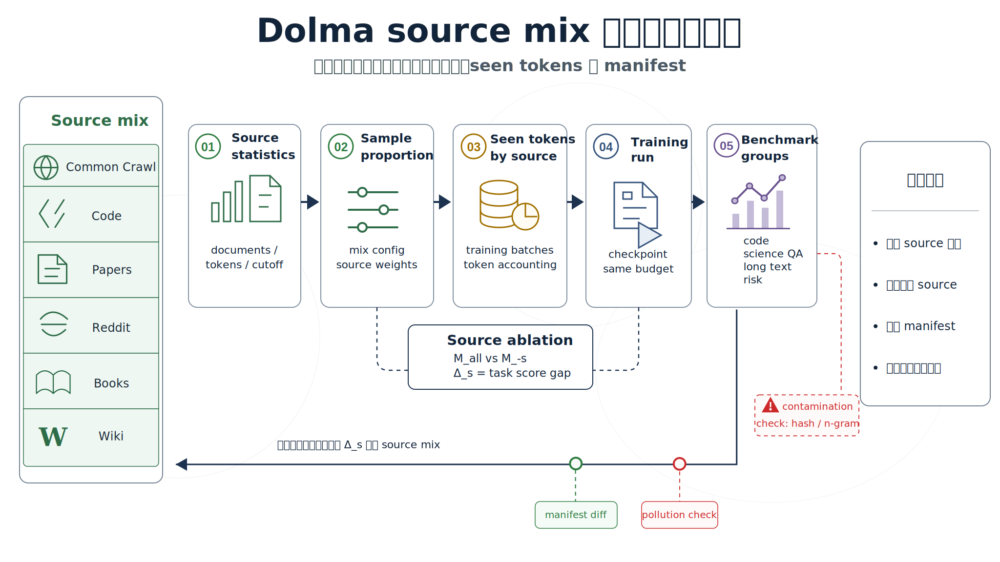

# 第38章：文本语料数据工程：开放 Web、过滤去重与透明账本

<div class="chapter-authors">穆冠霖（Guanlin Mu）；曹旭宏（Xuhong Cao）</div>

## 摘要

本章以 FineWeb 和 Dolma 为两个互补案例，讨论文本语料数据工程如何从开放 Web 快照走向可训练、可追溯、可诊断的数据资产。FineWeb 侧重 Common Crawl 文本抽取、过滤、去重、隐私处理和处理选择评估；Dolma 侧重来源账本、token 消费量、source ablation 和透明发布。两者共同说明，文本预训练语料的核心不只是规模，而是来源、处理、版本、证据链和复现条件。

## 关键词

文本语料；开放 Web；FineWeb；Dolma；过滤去重；透明账本；预训练数据

## 案例A：FineWeb：开放 Web 文本语料、过滤去重与处理选择

### 案例A：学习目标

通过本章学习，读者应能够：

- 区分 Common Crawl WARC 文件、WET 文本文件、抽取后的网页正文、过滤后的 FineWeb 文档和最终 token stream。
- 解释 FineWeb 为什么选择从 WARC 重新抽取正文，而不是直接使用 Common Crawl WET 文本。
- 理解 FineWeb 官方处理脚本中 `WarcReader`、`URLFilter`、`Trafilatura`、`LanguageFilter`、`GopherRepetitionFilter`、`GopherQualityFilter`、`C4QualityFilter`、`FineWebQualityFilter`、`MinhashDedup*` 和 `PIIFormatter` 的数据工程位置。
- 设计 Web 预训练文档记录 schema，使每条样本能追溯到来源、过滤、去重、token 统计和隐私处理状态。
- 用固定模型规模、固定 token 预算、固定评测集和重复随机种子比较不同数据处理策略。
- 将 FineWeb 的处理方式迁移到企业或研究项目时，识别版权、隐私、撤回、评测污染和跨语言迁移边界。

### 案例A：场景引入

一个团队准备训练 7B 参数级英文基础模型。第一版数据方案很直接：下载最近几年的 Common Crawl WET 文件，过滤掉非英文网页，做一次简单去重，然后把文本送进 tokenizer。离线抽样看起来还不错，很多页面确实是自然语言，token 数量也足够大。团队据此启动小模型预训练，却在几周后遇到三个难解释的问题。

第一，模型在若干常识题上没有随训练步数稳定提升。抽样回看训练片段，团队发现不少文本其实是网页菜单、页脚、cookie 横幅、SEO 关键词列表和自动生成的站内推荐。第二，同一类模板网页在不同月份和不同站点反复出现，训练 loss 看似平稳，但模型输出越来越容易复读模板化短句。第三，法务要求定位某个域名的样本和疑似邮箱地址，数据团队却只能在已经打散的 token shard 中模糊搜索，无法还原“这条文本来自哪个 crawl dump、哪条 URL、经过哪些过滤器、是否被去重保留”。

这三个问题说明，Common Crawl 只是网页快照，不是训练集。真正的数据工程任务不是“下载更多网页”，而是把每个网页样本转化为一条可追溯、可过滤、可去重、可评估、可撤回的训练记录。FineWeb 正是围绕这个问题建立的公开案例。

### 案例A.1：Common Crawl 是网页快照，不是训练语料

Common Crawl 的 WARC 文件保留网页抓取时的原始响应，包括 HTML、请求元数据和页面结构。WET 文件则是 Common Crawl 提供的文本抽取版本。对预训练数据工程来说，WET 的吸引力很强：它省去了 HTML 解析成本，体积更接近模型训练需要的文本。但 FineWeb 的实验发现，直接使用 WET 会留下过多 boilerplate、菜单文本和页面噪声，因此选择从 WARC 重新抽取正文。

#### 案例A.1.1 网页快照到训练文本的处理层

从网页快照到训练文本，至少隔着五层变换。

第一层是 URL 层过滤。某些域名、路径或子词模式本身就带有高风险，例如恶意站点、成人内容站点或明显垃圾页面。FineWeb 官方数据卡把 URL filtering 放在流程第一步，用 block-list 和 subword detection 移除来自恶意和 NSFW 网站的文档。

第二层是正文抽取。HTML 页面不是正文，页面中会混入导航、页脚、脚本、推荐列表和广告。FineWeb 使用 Trafilatura 从 WARC 原始 HTML 中抽取主文本，并在论文中通过消融实验比较 WARC+Trafilatura 与 WET 的差异。

第三层是语言识别。FineWeb 是英文语料，因此使用 FastText 语言过滤，保留英文得分达到阈值的文档。官方数据卡说明，FineWeb 移除 `en` language score 低于 0.65 的文档。

第四层是质量过滤。网页文本中常见重复 n-gram、异常行长、过短行、列表化页面和格式错误。FineWeb 使用 Gopher repetition / quality filters、部分 C4 filters，以及 FineWeb 自定义过滤器共同控制这些问题。

第五层是去重与隐私处理。FineWeb 使用按 crawl 独立执行的 MinHash 去重，并在公开发布时使用 PIIFormatter 匿名化邮箱和公网 IP 地址。

这些步骤构成的不是“清洗脚本集合”，而是一组训练前的数据契约。每一步都应有输入、输出、失败记录和可复查的参数。

#### 案例A.1.2 过滤强度决定训练信号

Web 语料清洗最容易出现两种相反错误。

过滤太少时，模型会吸收模板、乱码、广告、重复页面和非自然语言。它们可能在 token 统计上贡献很大，但对下游任务没有帮助，甚至会损伤语言分布。过滤太多时，语料规模下降，内容覆盖面变窄，一些长尾知识、论坛问答和非标准写作会被误删。对预训练来说，过滤器不是越严格越好，而是要在保留 token 预算和提升训练信号之间寻找可验证的平衡。

可用一个简单的训练收益函数描述这种权衡：

$$
U(F)=S_{eval}(D_F)-\lambda \cdot R_{risk}(D_F)-\mu \cdot \max(0, T_{target}-T_F)
$$

其中，$F$ 表示过滤策略，$D_F$ 是过滤后数据集，$S_{eval}$ 是固定评测协议下的模型得分，$R_{risk}$ 是隐私、版权、毒性和污染风险，$T_F$ 是保留 token 数，$T_{target}$ 是训练预算需要的 token 下限。这个公式不是 FineWeb 论文中的原始公式，而是对 FineWeb 实验思路的工程化抽象：最终选择过滤器时，不能只看样本“干净不干净”，还要看固定训练预算下模型是否变好，以及风险是否下降。

### 案例A.2：FineWeb 的数据定义和公开形态

FineWeb 的公开形态包括完整数据集、按 Common Crawl dump 切分的数据配置，以及较小的 sample 版本。官方数据卡说明，可以加载全量数据，也可以指定某个 crawl/dump；dump 名称采用 `CC-MAIN-(year)-(week number)` 格式。样本版本包括约 350B、100B 和 10B GPT-2 tokens 的随机子集，便于研究者在较低成本下复现实验或调试处理代码。

*表38-1 FineWeb 公开数据形态和工程用途*

| 形态 | 公开口径 | 工程用途 | 使用注意 |
| --- | ---: | --- | --- |
| FineWeb full dataset | 论文初版报告 15T tokens，官方数据卡持续列出后续 dump | 大规模英文 Web 预训练、数据消融、过滤策略研究 | 数据持续更新，引用规模时要说明数据卡访问时间和口径 |
| Per-dump config | 以 `CC-MAIN-YYYY-WW` 组织 | 按时间窗口抽样、复现实验、定位分布变化 | 不同 dump 的站点覆盖和质量不同，不能默认同分布 |
| `sample-350BT` | 约 350B GPT-2 tokens | 中等规模数据实验、去重和过滤策略验证 | 适合较大 ablation，不等于完整 FineWeb |
| `sample-100BT` | 约 100B GPT-2 tokens | 原型训练、快速评估、成本受限实验 | 需要记录抽样来源和随机性 |
| `sample-10BT` | 约 10B GPT-2 tokens | 管线调试、字段检查、读写性能测试 | 不适合得出最终数据质量结论 |

数据来源 Hugging Face FineWeb 数据卡的下载配置、sample 版本说明和 dump 命名规则；FineWeb 论文的初版规模口径。

#### 案例A.2.1 任务定义

FineWeb 的任务不是标注一个监督学习标签，而是为自回归语言模型构建预训练 token stream。给定 Common Crawl 的网页快照集合 $C=\{c_i\}$，目标是学习一条数据处理函数：

$$
P_\theta: C \rightarrow D=\{d_j\}
$$

其中每条输出文档 $d_j$ 至少包含抽取文本、来源元数据、语言信息、token 统计、过滤状态和去重状态。随后 tokenizer 将文档集合映射为训练序列：

$$
\tau(D)=\left[x_1,x_2,\ldots,x_N\right]
$$

预训练模型的标准目标仍是最小化 next-token 负对数似然：

$$
\mathcal{L}(\theta)=-\sum_{t=1}^{N}\log p_\theta(x_t|x_{<t})
$$

FineWeb 关注的是这个目标函数之前的部分：如何选择 $P_\theta$，使得同样的模型、同样的训练 token 和同样的评测集下，训练出的模型更好。

FineWeb 留给工程团队的判断主要有三类。第一类是正文抽取问题。WET 文本已经是“文本”，但未必是“可训练正文”。FineWeb 用 WARC+Trafilatura 取代 WET，说明正文抽取本身需要被视为影响模型能力的核心变量。

第二类是去重粒度问题。全局去重看起来更彻底，但 FineWeb 的消融结果显示，对所有 crawl 做全局 MinHash 去重并不一定更好；按 crawl 独立去重反而表现更强。这提醒数据工程团队，去重目标不是最大限度删除重复，而是删除会损害训练的重复。

第三类是过滤器验证问题。FineWeb 没有只凭人工规则决定过滤器，而是训练多组数据消融模型，在固定评测集上比较分数。过滤器阈值、C4 规则取舍和自定义启发式规则，都是在训练回验中确定的。

### 案例A.3：FineWeb 文档记录的关键字段

FineWeb 官方数据卡说明，样本会带有 `language`、`language_score` 和 `token_count` 注释；这些字段分别来自语言过滤器和 GPT-2 tokenizer 统计。若在企业内部复刻 FineWeb 类流程，还需要把处理状态、来源、去重和风险字段一起保留下来。否则一旦训练结果异常，就无法判断问题来自抽取、过滤、去重还是采样。

*表38-2 FineWeb 类 Web 文档记录 schema*

| 字段组 | 典型字段 | 来源或生成方式 | 工程用途 |
| --- | --- | --- | --- |
| 来源字段 | `url`、`dump`、`warc_record_id`、`fetch_time` | WARC 元数据和读取器补充 | 追溯原始网页、定位 crawl、响应撤回 |
| 文本字段 | `text`、`raw_html_hash`、`text_hash` | Trafilatura 抽取与哈希计算 | 支持训练读取、抽取质量检查和精确定位 |
| 语言字段 | `language`、`language_score` | FastText LanguageFilter | 控制英文语料边界，排查语言识别误差 |
| 质量字段 | `gopher_flags`、`c4_flags`、`fineweb_flags` | Gopher、C4 和 FineWeb filters | 解释样本为何被保留或移除 |
| 去重字段 | `minhash_signature`、`dedup_cluster_id`、`dedup_keep` | MinHash 去重阶段 | 控制近似重复和复查被删除样本 |
| 统计字段 | `token_count`、`char_count`、`line_count` | TokensCounter 和文档统计 | 估算训练预算，分析过滤影响 |
| 隐私字段 | `pii_email_replaced`、`pii_ip_replaced` | PIIFormatter | 记录邮箱和公网 IP 匿名化状态 |

表中 `gopher_flags`、`c4_flags`、`fineweb_flags` 等字段是作者为解释工程结构补充的字段组，不代表 FineWeb 官方数据卡逐项发布了这些列。FineWeb 官方明确发布的注释包括 `language`、`language_score` 和 `token_count`。

#### 案例A.3.1 一条样本不能只保存 text

下面是一条抽象化的 FineWeb 类文档记录。它不是 FineWeb 原始样本，而是根据 FineWeb 数据卡和 DataTrove 管线整理的工程示例。

```json
{
  "id": "CC-MAIN-2023-50/segment-x/warc-record-y",
  "url": "https://example.org/article",
  "dump": "CC-MAIN-2023-50",
  "text": "<Trafilatura 抽取后的正文>",
  "language": "en",
  "language_score": 0.94,
  "token_count": 1267,
  "filters": {
    "url_filter": "kept",
    "gopher_repetition": "kept",
    "gopher_quality": "kept",
    "c4_quality": "kept",
    "fineweb_quality": "kept"
  },
  "dedup": {
    "method": "minhash",
    "scope": "per_dump",
    "ngram": 5,
    "buckets": 14,
    "hashes_per_bucket": 8,
    "keep": true
  },
  "pii": {
    "email_formatted": true,
    "public_ip_formatted": true
  }
}
```

这个例子展示了 FineWeb 类语料的基本思想：`text` 是训练入口，但它不能单独解释样本质量。真正支撑复查的是来源、语言分数、过滤状态、去重范围和隐私处理记录。

#### 案例A.3.2 schema 与训练评估的关系

FineWeb 的评估不是直接评估单条样本，而是评估由某个处理策略生成的数据版本。设某个处理版本 $v$ 对应数据集 $D_v$，训练得到模型 $M_v$。若评测集合为 $B=\{b_1,\ldots,b_k\}$，每个任务得分为 $s(M_v,b_i)$，则可以定义一个聚合得分：

$$
S(M_v)=\frac{1}{k}\sum_{i=1}^{k}s(M_v,b_i)
$$

FineWeb 论文采用固定模型、固定训练 token、固定评测任务、重复随机样本和不同初始化种子的方式比较数据版本。工程上可以进一步记录每个数据版本的处理 manifest：

$$
Manifest(v)=\{code\_commit, dump\_set, filter\_params, dedup\_params, tokenizer, sample\_seed\}
$$

没有这个 manifest，即使复现了评测脚本，也无法复现“到底训练了哪个数据版本”。

### 案例A.4：FineWeb 的代码化处理流程

FineWeb 的一个重要特点是处理过程有公开脚本。DataTrove 仓库中的 `examples/fineweb.py` 声明该文件用于处理和创建 FineWeb 数据集。脚本分为两大部分：先对每个 dump 做主处理，再对处理后的输出做 MinHash 去重和 PII 格式化。

#### 案例A.4.1 主处理流水线

主处理流水线可抽象为以下顺序。类名来自 DataTrove 的 FineWeb 示例脚本，文字说明为本章整理。

*表38-3 FineWeb 主处理流水线中的关键模块*

| 顺序 | DataTrove 模块 | 输入 | 输出 | 作用 |
| ---: | --- | --- | --- | --- |
| 1 | `WarcReader` | Common Crawl WARC segments | 原始 HTML 文档流 | 从 `s3://commoncrawl/crawl-data/.../warc/` 读取网页快照 |
| 2 | `URLFilter` | URL 和原始文档 | 保留或移除文档 | 移除恶意、NSFW 或 block-list 命中的来源 |
| 3 | `Trafilatura` | 原始 HTML | 抽取正文文本 | 减少菜单、页脚和页面模板噪声 |
| 4 | `LanguageFilter` | 文本 | 英文文档流和非英文排除日志 | 保留英文得分达到阈值的文档 |
| 5 | `GopherRepetitionFilter` | 英文文本 | 重复模式过滤结果 | 移除重复 n-gram 和异常重复内容 |
| 6 | `GopherQualityFilter` | 文本统计 | 质量过滤结果 | 应用 MassiveText/Gopher 风格质量规则 |
| 7 | `C4QualityFilter` | 文本统计 | C4 规则过滤结果 | 应用 FineWeb 采用的 C4 规则子集 |
| 8 | `FineWebQualityFilter` | 文本统计 | 自定义过滤结果 | 移除列表化、重复行和异常换行文档 |
| 9 | `JsonlWriter` | 保留文档 | JSONL 分片 | 写出进入去重阶段的文档 |

数据来源 DataTrove `examples/fineweb.py` 的导入模块和主处理 pipeline；FineWeb 数据卡的 data processing steps。

主处理阶段的代码结构可以概括为：

```python
pipeline = [
    WarcReader(common_crawl_warc_path),
    URLFilter(...),
    Trafilatura(favour_precision=True),
    LanguageFilter(...),
    GopherRepetitionFilter(...),
    GopherQualityFilter(...),
    C4QualityFilter(...),
    FineWebQualityFilter(...),
    JsonlWriter(base_processing_output)
]
```

这段是概念化伪代码，用于说明 FineWeb 示例脚本中的模块顺序；真实参数、日志目录、S3 路径、任务数和 Slurm 资源配置以 DataTrove 仓库脚本为准。

#### 案例A.4.2 去重和隐私处理流水线

FineWeb 使用 MinHash 做近似去重。MinHash 的目标是近似估计两个文档的 Jaccard 相似度。若文档 $A$ 和 $B$ 被表示为 5-gram 集合，则相似度可写为：

$$
J(A,B)=\frac{|G_5(A)\cap G_5(B)|}{|G_5(A)\cup G_5(B)|}
$$

MinHash 用多个哈希函数近似这个相似度。FineWeb 论文说明其去重参数为 5-grams、112 个哈希函数，拆成 14 个 bucket，每个 bucket 8 个 hash；任一 bucket 的 8 个 MinHash 相同即可判为重复候选。DataTrove 示例脚本中的 `MinhashConfig` 也对应 `n_grams=5`、`num_buckets=14`、`hashes_per_bucket=8`。



*图38-1 FineWeb MinHash 去重和 PII 处理流程。Source: original illustration based on Hugging Face DataTrove `examples/fineweb.py` and FineWeb dataset card.*

#### 案例A.4.3 FineWeb 按 crawl 独立去重的判断

直觉上，全局去重似乎更彻底：把 96 个 crawl 放在一起，删除所有近似重复文档。FineWeb 的消融实验却给了相反信号。论文描述了一个关键现象：从最新 crawl 开始向旧 crawl 做全局去重时，旧 crawl 会被大量删除；在某个旧 snapshot 中，保留下来的 10% 数据反而比被删除的 90% 更差，包含更多广告、关键词列表和格式异常文本。最终，FineWeb 选择对每个 crawl 独立 MinHash 去重。

这个结果对工程实践很重要。去重不是数学上越彻底越好，而是要看它如何改变数据分布。全局去重会让新旧 crawl 之间的时间分布、站点覆盖和重复簇结构发生复杂变化；如果只看“删除了多少重复”，可能误删更有价值的样本，保留低质量长尾。


*图38-2 FineWeb 数据处理选择的消融评估回路。Source: original illustration based on FineWeb paper Section 3.1.*

### 案例A.5：FineWeb 的数据处理选择评估

FineWeb 的评估方法与一般数据集介绍不同。它把数据处理步骤当成实验变量，通过训练 ablation models 比较不同数据版本。论文说明，数据消融模型在模型参数、架构超参数、训练 token 数和训练步数上保持一致；为了降低随机抽样影响，每个数据版本训练两个模型，使用不同随机子集和不同初始化种子，然后比较平均分。

#### 案例A.5.1 固定变量

FineWeb 的评估协议可以抽象为表38-4。

*表38-4 FineWeb 数据消融评估协议*

| 控制项 | FineWeb 论文做法 | 数据工程意义 |
| --- | --- | --- |
| 模型规模 | ablation 模型为 1.82B 参数，Llama 架构 | 避免模型规模变化掩盖数据差异 |
| tokenizer | GPT-2 tokenizer | 固定 token 统计口径 |
| 训练预算 | 过滤消融约 28B tokens，部分去重和累计改进实验为 350B tokens | 区分快速筛选和高成本验证 |
| 重复实验 | 每个数据版本训练两个模型，随机子集和初始化种子不同 | 降低抽样和初始化噪声 |
| 训练框架 | Nanotron | 固定训练实现 |
| 评测框架 | lighteval | 固定评测实现 |
| 评测任务 | CommonSense QA、HellaSwag、OpenBook QA、PIQA、SIQA、WinoGrande、ARC、MMLU | 用多任务信号评估数据处理效果 |

数据来源 FineWeb paper Section 3.1 Experimental setup。

若第 $v$ 个数据版本训练两次，得到模型 $M_{v,1}$ 和 $M_{v,2}$，每个模型在 $k$ 个任务上得分，则版本得分可以写为：

$$
\bar{S}_v=\frac{1}{2k}\sum_{r=1}^{2}\sum_{i=1}^{k}s(M_{v,r},b_i)
$$

这个公式同样是对 FineWeb 评估协议的工程化表达。它强调评估对象不是单个样本，而是“处理策略生成的数据版本”。

过滤器不能只靠规则直觉一次决定。FineWeb 的过滤器选择可以分为三步。

第一步，建立基础过滤。FineWeb 从 WARC 抽取文本后，先做 URL block-list、英文语言识别和 Gopher/MassiveText 风格质量过滤。论文报告，在对 96 个 snapshot 的 WARC 抽取文本应用这些基础步骤后，得到约 36T GPT-2 tokens 的数据。

第二步，比较已有规则。FineWeb 研究 C4 规则时发现，terminal punctuation 规则单独带来明显提升，但会删除约 30% tokens；最终 FineWeb 采用除 terminal punctuation 外的 C4 规则子集，因为后者删除更少数据并取得更合适的训练收益。

第三步，设计自定义过滤器。FineWeb 收集 50 多个文档级和跨文档统计指标，比较“较高质量”和“较低质量”数据分布，选择能区分两者的阈值，再用 28B token ablation runs 验证。最终被采用的自定义过滤器关注三类问题：行尾标点比例过低、重复行字符比例过高、短行比例异常。

#### 案例A.5.2 常见失败和修复动作

FineWeb 的经验可以转化为一张 Web 预训练语料错误归因表。它不是 FineWeb 官方表格，而是本章根据 FineWeb 论文和数据卡整理的工程复盘。

*表38-5 FineWeb 类 Web 语料常见失败与修复动作*

| 错误类型 | 现象 | 可能根因 | 数据工程修复动作 |
| --- | --- | --- | --- |
| 页面模板残留 | 模型复读菜单、页脚、cookie 文案 | 直接使用 WET 或正文抽取质量差 | 回到 WARC，用 Trafilatura 或同类工具重新抽取，并抽样检查模板残留 |
| 非英文混入 | 英文模型训练中出现多语乱码和混排 | 语言识别阈值过宽或段落混语未处理 | 保留 `language_score`，按分桶抽检，必要时段落级过滤 |
| 重复簇过大 | loss 虚高稳定但下游无提升 | 模板站点、镜像站点、跨月重复 | 使用 MinHash 去重，并记录重复簇和去重范围 |
| 全局去重伤害分布 | 删除大量旧 crawl 内容后模型不变好 | 全局去重改变时间和质量分布 | 比较 per-crawl 与 global dedup，固定训练预算回验 |
| 过滤器过严 | token 规模下降，长尾知识被删 | 单条规则删除比例过高 | 记录每个过滤器 token removal rate，用 ablation 决定阈值 |
| 隐私样本残留 | 邮箱、公网 IP 等可识别信息进入发布数据 | PII 处理缺失或误检漏检 | 使用 PIIFormatter 或同类规则，记录替换策略和边界 |

### 案例A.6：公开 Web 语料的使用边界

FineWeb 是开放 Web 预训练语料工程的强案例，但它不能被简单理解成“可以直接商用的一切网页文本”。公开数据集、开放代码和 ODC-By 许可证降低了研究复现门槛，却不自动消除使用者所在司法辖区、业务场景和下游模型发布中的版权、隐私、安全与撤回责任。

FineWeb 适合用于英文基础模型预训练、Web 数据过滤策略研究、去重策略消融、DataTrove 类大规模文本处理管线调试，以及预训练语料版本治理教学。它尤其适合回答“某个数据处理步骤是否让模型变好”这类问题，因为 FineWeb 的公开资料提供了代码、数据卡、论文消融和评估协议。

FineWeb 不适合直接回答所有语言、所有领域、所有合规环境下的训练数据问题。它主要由 Common Crawl 英文 Web 内容构成，不等价于中文语料、专业版权语料、医疗法律财务领域语料，也不等价于面向对话助手的 SFT 或偏好数据。

企业复刻 FineWeb 思路时，最值得迁移的不是某个固定阈值，而是四类工程对象。

第一，处理代码要版本化。`code_commit`、过滤器参数、tokenizer、抽样种子和 dump 列表都应进入 manifest。第二，过滤器要有排除日志。每个被删除样本最好能说明被哪个规则删除。第三，去重要保留范围和参数。per-dump、per-domain、global dedup 的影响不同，不能只记录“已去重”。第四，评估要固定变量。模型结构、训练 token、训练步数、评测集和随机种子不固定，数据处理结论就不可比。

FineWeb 不应被用作无审查商业训练全集。对于商业模型，仍需做许可证、robots/terms、数据撤回、隐私和敏感内容审查。FineWeb 也不应被当作“高质量英文语料”的唯一标准；它的质量定义来自固定 ablation 模型和一组学术 benchmark，不必然覆盖产品真实使用中的帮助性、安全性、事实更新和指令遵循需求。

对于中文或多语训练，不能直接照搬 FineWeb 的英文 FastText 阈值、英文 tokenizer 统计和英文页面格式假设。迁移时需要重新校准语言识别、繁简处理、站点模板、域名分布、低质量页面规则和评估任务。

### 案例A：小结

FineWeb 讲清楚了一个常被低估的问题：Web 预训练语料不是 Common Crawl 的下载结果，而是代码、过滤器、去重策略、评估协议和发布说明共同构成的数据资产。本章的核心结论有三点。

第一，网页正文抽取是模型能力变量。FineWeb 从 WARC 使用 Trafilatura 重新抽取正文，正是因为 WET 文本会残留过多模板和菜单噪声。第二，去重策略必须用训练结果验证。FineWeb 的实验表明，全局 MinHash 去重不一定优于按 crawl 独立去重，删除更多重复不等于得到更好的训练数据。第三，过滤器选择应当进入固定评估协议。FineWeb 通过同构 ablation 模型、固定 token 预算、lighteval 评测和重复随机种子，把数据处理选择变成可复查的工程实验。

对本书读者而言，FineWeb 最值得学习的不是照搬某个 token 规模，而是把预训练语料工程做成一套可追溯、可复现、可评估、可审计的系统。

## 案例B：Dolma：预训练语料透明账本与可归因评估

### 案例B：学习目标

通过本章学习，读者应能够：

- 解释为什么权重开放不能替代训练数据透明。
- 读懂 Dolma 的版本、来源统计、采样比例和 ODC-BY 使用边界。
- 区分文档记录、source card 和训练 manifest 在审计中的作用。
- 用 token accounting 公式描述 raw tokens、filtered tokens、sample proportion 和 seen tokens 的关系。
- 按 Dolma Toolkit 的 tag、dedup、mix、tokenize 四个动作理解透明语料的证据链。
- 设计企业内部预训练语料的 source 账本、撤回账本、污染检查和版本冻结机制。

### 案例B.1：问题场景：权重开放后仍然无法解释模型

两个团队都拿到了同一个 7B 开放模型权重。第一个团队想继续预训练，让模型增强代码和科学问答能力；第二个团队想分析模型为什么在若干事实题上给出过时答案。权重、推理代码和部分评测脚本都能下载，但他们很快遇到同一个问题：模型到底见过什么数据，没人能回答。

继续预训练团队需要知道原模型语料中代码、论文、百科、Web 和社交媒体分别占多少，避免在同类数据上重复过采样。偏差分析团队需要知道某些网页、论文、论坛讨论或 benchmark 题解是否进入过训练，判断问题来自知识缺失、采样权重、污染还是模型训练本身。没有训练语料和处理记录，所有解释都只能停留在猜测。

Dolma 要解决的正是这个问题。它把英文预训练语料从不可见的数据配方，变成一组可下载、可统计、可处理、可撤回、可审计的 source。OLMo 在本章中不是并列主角，而是 Dolma 被透明训练链路消费的下游例子：它提醒我们，开放模型研究不应只开放权重，还应尽可能开放训练数据、处理工具和评估代码。

#### 案例B.1.1 开放模型研究需要数据证据

“开放”有不同层次。只发布权重，可以让用户运行模型，却不能让研究者解释模型。发布训练代码，可以让用户复现训练框架，却仍然不能说明模型实际看过什么。真正支撑科学研究的数据透明，至少需要回答六类问题。

- 来源问题：每个 document 来自 Common Crawl、代码仓库、论文、书籍、百科还是社交平台。
- 版本问题：来源获取时间、处理脚本版本和过滤规则是什么。
- 规模问题：raw tokens、filtered tokens、sampled tokens 和 seen tokens 是否一致。
- 污染问题：评测集、题解、客户测试集是否与训练语料重叠。
- 许可问题：数据集发布许可与原始来源条款如何共同约束使用者。
- 撤回问题：若用户请求移除个人数据，能否定位并处理对应文档。

Dolma 数据卡直接体现了这种设计取向：它列出版本、summary statistics、下载方式、许可信息，并提供个人数据移除入口。Dolma GitHub 仓库进一步给出数据和工具，使透明不只停留在论文描述中。

对 Dolma 这类语料来说，透明的核心对象是账本，单条 `text` 不是唯一对象。更重要的是围绕 `text` 形成三本账。

第一本是 source 账，记录某类数据来自哪里、规模多大、截止日期是什么、处理方法是什么。第二本是处理账，记录 tagger、过滤器、去重策略、mixer 和 tokenizer 如何改变原始文档。第三本是训练账，记录某次训练实际采样了哪些 source、采样比例是多少、seen tokens 如何分布到训练 step。

如果这三本账断开，透明就会退化为“可下载”。数据可以下载，但不能解释；模型可以训练，但不能审计；版本可以更新，但不能比较。

### 案例B.2：数据集概览：版本、规模与来源结构

Dolma 不是单一静态文件，而是带版本演进的语料资产。Hugging Face 数据卡列出 `v1`、`v1_5`、`v1_5-sample`、`v1_6`、`v1_6-sample` 和 `v1_7` 等版本；其中 `v1_7` 用于训练 OLMo 7B-v1.7，并引入新来源、更多质量过滤和 fuzzy deduplication。

*表38-6 Dolma 公开版本和用途*

| 版本 | 发布时间 | 压缩体积 | 数据卡说明 | 工程用途 |
| --- | --- | ---: | --- | --- |
| `v1` | 2023-08-18 | 6.0 TB | Dolma 第一版 | 追溯最早公开语料形态 |
| `v1_5` | 2023-10-31 | 6.4 TB | 用于训练 OLMo-1B，约 3T tokens | 复查 OLMo 早期训练语料 |
| `v1_5-sample` | 2023-10-31 | 2.9 TB | 约 1.9T tokens 的样本，用于 OLMo-7B | 低于 full 版本的训练样本追踪 |
| `v1_6` | 2024-01-31 | 5.4 TB | 在 v1.5 基础上增加部分去重和重复 n-gram 过滤 | 研究过滤和去重演进 |
| `v1_6-sample` | 2024-01-31 | 16.4 GB | 约 10B tokens 的探索样本 | 快速调试和数据浏览 |
| `v1_7` | 2024-04-15 | 4.5 TB | 用于训练 OLMo 7B-v1.7，新来源、更多质量过滤、fuzzy deduplication | 当前默认版本和透明训练参照 |

数据来源 Hugging Face `allenai/dolma` 数据卡 Versions 小节。

#### 案例B.2.1 v1.6 来源结构

Dolma 的来源覆盖 Web、代码、论文、社交媒体、书籍和百科。为了避免不同版本混淆，表38-7 使用数据卡中 v1.6 summary statistics 的大类统计。v1.7 的来源更加细分，新增 Refined Web、StarCoder、arXiv、StackExchange、Flan、OpenWebMath、Algebraic Stack、MegaWika 等 source；后续写作或实验应明确使用哪个版本。

*表38-7 Dolma v1.6 来源统计*

| 来源 | 文档类型 | UTF-8 bytes | 文档数 | Unicode words | Llama tokens |
| --- | --- | ---: | ---: | ---: | ---: |
| Common Crawl | web pages | 9,022 GB | 3,370M | 1,775B | 2,281B |
| The Stack | code | 1,043 GB | 210M | 260B | 411B |
| C4 | web pages | 790 GB | 364M | 153B | 198B |
| Reddit | social media | 339 GB | 377M | 72B | 89B |
| PeS2o | STEM papers | 268 GB | 38.8M | 50B | 70B |
| Project Gutenberg | books | 20.4 GB | 0.056M | 4.0B | 6.0B |
| Wikipedia and Wikibooks | encyclopedic | 16.2 GB | 6.2M | 3.7B | 4.3B |
| Total | mixed | 11,519 GB | 4,367M | 2,318B | 3,059B |

数据来源 Hugging Face `allenai/dolma` 数据卡 Summary Statistics v1.6。表中 GB、M、B 均沿用数据卡口径。

表38-7 不应只被读成规模展示。它提示三类工程事实。

第一，Dolma 是 source mix，而不是单一 Web dump。Common Crawl 占比很高，但代码、论文、社交媒体、书籍和百科都以不同形式进入语料。模型能力变化不能只笼统归因于“Web 数据更多”。

第二，不同统计口径服务不同问题。UTF-8 bytes 适合估算存储和处理成本，document count 适合观察样本颗粒度，Unicode words 和 Llama tokens 则更接近训练预算。把这些口径混在一起，会让数据规模讨论失真。

第三，版本之间不能直接横比。v1.6 和 v1.7 的来源拆分、过滤规则和 sample proportion 不同。如果一个模型用 v1.7 训练，不能只拿 v1.6 的大类表解释训练行为。

### 案例B.3：以 source 账本拆解一条透明链路

本节不从单条文本开讲，而是从 Dolma 的 source 账本拆解透明预训练语料的链路。这里的“样本”不是一张图或一道题，而是一条从 source 到文档、再到训练 manifest 的证据路径。

#### 案例B.3.1 从 source 到 document

Dolma 的任务不是给每条文本标注监督标签，而是让训练消费记录可以被复原。设 source 集合为 $S=\{s_1,\ldots,s_m\}$，每个 source 经过处理函数 $P_s$ 后得到文档集合 $D_s$：

$$
D_s=P_s(R_s, C_s)
$$

其中 $R_s$ 是原始来源，$C_s$ 是该 source 的处理配置，包括 tagger、过滤器、去重策略、采样比例和 tokenizer。最终训练语料是多个 source 的混合：

$$
D=\bigcup_{s \in S} Sample(D_s, r_s)
$$

Dolma 的透明性体现在：$S$、$R_s$、$C_s$、$r_s$ 和版本信息都尽量被公开记录。这样模型训练不再只是“用了三万亿 token”，而是可以追踪到哪些 source 贡献了多少、如何处理、如何采样。

#### 案例B.3.2 token 账要看训练实际消费量

多来源语料最容易被误读的是 token 规模。一个 source 的 raw tokens 很大，不代表它在训练中贡献同等比例；过滤、去重、sample proportion 和多轮 epoch 都会改变最终 seen tokens。

可以把某个 source $s$ 在训练中的实际贡献写成：

$$
T^{seen}_s = T^{filtered}_s \times r_s \times e_s
$$

其中，$T^{filtered}_s$ 是过滤后的 token 数，$r_s$ 是采样比例，$e_s$ 是训练中被重复看到的 epoch 或等价采样次数。训练 mix 中该 source 的比例为：

$$
p_s=\frac{T^{seen}_s}{\sum_j T^{seen}_j}
$$

Dolma v1.7 数据卡中同时列出 source token 数和 sample proportion，正是为了让使用者区分“数据集里有什么”和“训练实际看了多少”。

#### 案例B.3.3 一条文档的三层读法

透明语料不是把 `text` 打包上传就结束。至少需要三层记录：单条文档记录、source card 和训练版本 manifest。单条文档用于训练和定位，source card 用于解释数据来源和处理规则，训练 manifest 用于复现某次模型训练实际消费的数据。

*表38-8 Dolma 类透明语料记录 schema*

| 层级 | 典型字段 | 来源或生成方式 | 工程用途 |
| --- | --- | --- | --- |
| 文档级 | `id`、`source`、`text`、`text_hash` | 数据读取和哈希计算 | 定位样本、去重、训练读取 |
| 文档级 | `created_at`、`url_or_origin`、`license_hint` | 原始 source 元数据 | 授权复核和时间追踪 |
| 文档级 | `language_tag`、`toxicity_tag`、`perplexity_score` | Dolma Toolkit taggers 或自定义 tagger | 质量过滤和风险分桶 |
| source 级 | `source_name`、`source_version`、`raw_size`、`filtered_size` | source card 与统计脚本 | 解释数据组成 |
| source 级 | `dedup_policy`、`filter_config`、`sample_proportion` | Dolma mixer 和处理配置 | 复现 source mix |
| 训练级 | `dolma_version`、`tokenizer`、`sample_seed`、`seen_tokens` | 训练 manifest | 复现实验和解释指标变化 |
| 治理级 | `removal_status`、`known_limitations`、`release_constraints` | 数据卡和治理记录 | 处理撤回、偏差和使用边界 |

表中字段是作者根据 Dolma 数据卡、Dolma Toolkit 文档和透明训练审计需求整理的工程 schema，不表示 Dolma 官方逐项发布了这些字段。

下面是一个抽象化的 Dolma 类文档记录，用于说明透明语料如何把样本、source 和训练版本连接起来。

```json
{
  "id": "dolma-v1_7/common-crawl/doc-000001",
  "source": "Dolma's CC",
  "source_version": "v1_7",
  "text": "<document text>",
  "text_hash": "sha256:...",
  "tags": {
    "language": "en",
    "toxicity_bucket": "low",
    "perplexity_bucket": "normal"
  },
  "processing": {
    "tagger_config": "dolma-toolkit-config-x",
    "dedup_policy": "fuzzy_dedup",
    "sample_proportion": 0.5
  },
  "training_manifest": {
    "tokenizer": "OLMo tokenizer version",
    "dolma_version": "v1_7",
    "included_in_run": true
  }
}
```

这条记录不能只看单层字段。放到 Dolma 中，文档层、source 层和训练层必须能相互指回。若文档有 `source` 但没有 source card，只能定位样本，不能解释来源；若 source card 有统计但没有训练 manifest，只能说明数据集里有什么，不能说明模型实际看了什么；若 manifest 有采样比例但没有文档 hash，撤回和污染检查就会断链。

### 案例B.4：Dolma Toolkit 让证据链可执行

Dolma GitHub 仓库说明，Dolma 同时是数据集和工具包。Dolma Toolkit 支持单机、集群和云环境，内置语言检测、毒性检测、perplexity scoring，以及 Gopher、C4、OpenWebText 等常见过滤 recipe；去重部分使用 Rust Bloom filter 加速。

#### 案例B.4.1 四个动作对应四类证据

Dolma Toolkit 文档把数据整理概括为四个动作：tag、dedup、mix、tokenize。它们不是孤立脚本，而是证据链的生成器：tag 记录文档属性，dedup 记录保留和删除，mix 记录采样比例，tokenize 记录进入训练的 token 口径。

*表38-9 Dolma Toolkit 处理动作与证据输出*

| 顺序 | 动作 | 官方文档说明 | 证据输出 | 主要风险 |
| ---: | --- | --- | --- | --- |
| 1 | Taggers | 给文档 span 打语言、毒性、perplexity 等属性标签 | 文档质量标签和风险标签 | tagger 版本变化会改变过滤结果 |
| 2 | Deduplication | 基于内容或元数据对文档去重 | 去重策略、保留优先级、删除记录 | 跨 source 去重会改变 source mix |
| 3 | Mixer | 根据属性值移除、过滤或混合文档 | sample proportion、source mix、数据版本 | sample proportion 不透明会导致 token accounting 错误 |
| 4 | Tokenization | 使用 Hugging Face 兼容 tokenizer | token 计数、tokenizer 版本、训练流 | tokenizer 变化会改变 token 数和训练预算 |

数据来源 Dolma Toolkit documentation README。



*图38-3 Dolma 透明语料证据链。Source: original illustration based on AllenAI Dolma Toolkit documentation.*

这里要注意工具链和人工审计的边界。工具链能稳定地产生统计、标签、hash 和 manifest，但它不能替代所有审计。许可边界、PII removal、评测污染和 source 代表性仍需要人工规则、抽样复核或专门的检测任务介入。

这也是 Dolma 类透明语料和普通“清洗脚本集合”的区别。普通脚本只回答“我删掉了什么”，透明工具链还要回答“为什么删、删后分布怎么变、训练是否真的受益、后续能否撤回”。如果某个处理动作不能留下可解释证据，它就很难支撑透明训练。

### 案例B.5：评估从最高分转向可归因

透明语料的评估重点不是“最高分”，而是“分数变化能不能解释”。Dolma 这类 source-level 语料让模型评估不再停在 leaderboard 上，而是能顺着训练日志回到 source、版本和采样比例。

#### 案例B.5.1 source ablation 定位能力来源

如果要判断某个 source 是否影响模型能力，可以做 source ablation。设完整训练得到模型 $M_{all}$，移除 source $s$ 后得到模型 $M_{-s}$，在任务集合 $B$ 上的平均差异为：

$$
\Delta_s=\frac{1}{|B|}\sum_{b \in B} \left[score(M_{all}, b)-score(M_{-s}, b)\right]
$$

当 $\Delta_s$ 在代码任务、科学问答或长文本任务上明显变化时，数据团队才能把能力变化回溯到 source mix，而不是泛泛归因于“模型参数”。



*图38-4 Dolma source mix 与训练诊断回路。Source: original illustration based on Dolma dataset card and OLMo training use.*

#### 案例B.5.2 诊断清单

*表38-10 Dolma 类透明语料评估和诊断表*

| 评估问题 | 所需记录 | 指标或证据 | 可能动作 |
| --- | --- | --- | --- |
| 某类能力来自哪个 source | source mix、sample proportion、seen tokens | source ablation、任务得分差 $\Delta_s$ | 调整 source 权重或补充数据 |
| 某个评测是否被污染 | 文档 hash、n-gram index、eval set hash | overlap rate、contamination span | 删除污染样本并冻结新版本 |
| 训练 loss 异常波动 | batch source 记录、tokenizer 版本 | source-specific loss、token distribution | 回查采样器和 source shard |
| 社交媒体风险升高 | toxicity tag、PII tag、source card | risk tag rate、人工抽检 | 收紧过滤或降低采样比例 |
| 版本间不可比 | dolma_version、filter_config、dedup_policy | manifest diff | 固定版本或重跑对照实验 |

#### 案例B.5.3 常见失败模式

*表38-11 Dolma 类透明语料常见失败与修复动作*

| 失败模式 | 表现 | 可能根因 | 治理方式 |
| --- | --- | --- | --- |
| source mix 漂移 | 新版本某类任务突然退化 | sample proportion 或过滤规则变化 | 比较 manifest diff，回滚或分层重采样 |
| token accounting 不一致 | 报告规模与训练 seen tokens 对不上 | raw、filtered、sampled tokens 混用 | 同时报告 raw、filtered、sampled、seen tokens |
| 跨来源重复 | 论文摘要、百科镜像、代码片段重复出现 | 只做 source 内去重 | 增加跨 source 去重并记录保留优先级 |
| 评测污染 | benchmark 分数异常偏高 | Web 或论坛含题目和题解 | 建立 eval hash/n-gram 去污染索引 |
| 撤回不可定位 | PII removal 请求无法处理 | 缺少 source/id/hash 映射 | 建立 removal ledger 和 shard 反向索引 |
| 许可边界模糊 | 误把 ODC-BY 当作原始来源授权 | 忽略原始 source terms | 在 source card 中保留原始条款和限制 |

这些失败模式说明，透明语料的质量不只取决于文本是否干净。一个透明训练样本至少要同时通过三类检查：source 是否可解释，处理动作是否可复现，训练消费是否可追踪。缺少任何一类检查，数据都可能成为“公开但不可审计”的语料。

### 案例B.6：透明语料的复用边界

Dolma 适合用于开放语言模型预训练研究、source mix 实验、透明数据治理教学、训练数据审计方法验证，以及企业内部 manifest 设计参照。它尤其适合回答“训练数据如何影响模型能力和局限”这类研究问题，因为它把数据、数据卡和处理工具一起公开。

Dolma 不应被理解为所有来源都可无条件商用。Hugging Face 数据卡说明 Dolma 按 ODC-BY 发布，同时使用者仍受原始数据来源的许可协议和使用条款约束。也就是说，Dolma 的发布许可不自动抹平 Common Crawl、Reddit、代码、论文、书籍等原始来源的边界。

企业内部通常不能公开训练数据，但可以迁移 Dolma 的透明做法。最低可行版本包括：

- 为每个 source 建 source card，记录来源、版本、许可、获取时间、过滤规则和限制。
- 为每个训练版本冻结 manifest，记录 source mix、sample proportion、tokenizer、filter_config、dedup_policy 和 sample_seed。
- 为主要 source 建 validation split，支持 source-specific loss 和 source ablation。
- 为评测集、客户测试集和线上问题库建立去污染索引。
- 建立 removal ledger，使 URL、document id 或 text hash 能映射到训练 shard。

同时，Dolma 不适合直接作为中文、多语或垂直行业语料的质量标准。它主要是英文预训练语料，迁移到中文、医疗、法律或金融场景时，需要重新定义 source、许可、过滤器和评估任务。Dolma 也不应被用来证明开放语料天然安全。透明的意义是缺陷可见、可定位、可修复，而不是宣称缺陷不存在。

### 案例B：小结

Dolma 把预训练语料从不可见的数据配方推进到有账可查的数据资产。本章的核心结论有三点。

第一，透明预训练语料的基本单位不是单条 `text`，而是能连接 source、处理配置、采样比例和训练 manifest 的文档记录。第二，source mix 必须用 token accounting 解释，不能只报告原始规模。第三，Dolma Toolkit 的 tag、dedup、mix、tokenize 四个动作，为企业内部构建可复现训练语料提供了清晰模板。

对本书读者而言，Dolma 最值得迁移的不是某个具体 source，也不是三万亿 token 的规模，而是把训练数据留下证据的方式。只要 source、处理动作、采样比例、训练 manifest 和治理记录能连成链，预训练语料才具备继续研究、错误归因和长期维护的基础。

## 本章小结

FineWeb 展示了开放 Web 文本从网页快照转化为训练语料的处理链路，Dolma 则展示了预训练语料如何通过来源账本和诊断协议变成可解释资产。二者合在一起，构成文本语料数据工程的两条主线：一条关注过滤、去重、隐私处理和训练效果，另一条关注来源结构、token 账本、版本透明度和可归因评估。

## 参考文献

Penedo, G., Kydlíček, H., Allal, L. B., Lozhkov, A., Mitchell, M., Raffel, C., von Werra, L., & Wolf, T. (2024). The FineWeb Datasets: Decanting the Web for the Finest Text Data at Scale. NeurIPS 2024 Datasets and Benchmarks Track. https://arxiv.org/abs/2406.17557.

Hugging Face. (2026). HuggingFaceFW/fineweb Dataset Card. https://huggingface.co/datasets/HuggingFaceFW/fineweb.

Hugging Face. (2026). DataTrove FineWeb Processing Script. https://github.com/huggingface/datatrove/blob/main/examples/fineweb.py.

Penedo, G., Kydlíček, H., Cappelli, A., Sasko, M., & Wolf, T. (2024). DataTrove large scale data processing. https://github.com/huggingface/datatrove.

Luccioni, S., & Viviano, J. (2021). What's in the Box? A Preliminary Analysis of Undesirable Content in the Common Crawl Corpus. https://arxiv.org/abs/2105.02732.

Soldaini, L., Kinney, R., Bhagia, A., Schwenk, D., Atkinson, D., Authur, R., et al. (2024). Dolma: an Open Corpus of Three Trillion Tokens for Language Model Pretraining Research. ACL 2024. https://arxiv.org/abs/2402.00159.

Allen Institute for AI. (2023). Ai2 Dolma: 3 trillion token open corpus for language model pretraining. https://allenai.org/blog/dolma-3-trillion-tokens-open-llm-corpus-9a0ff4b8da64.

AllenAI. (2026). allenai/dolma Dataset Card. https://huggingface.co/datasets/allenai/dolma.

AllenAI. (2026). Dolma Dataset and Toolkit Repository. https://github.com/allenai/dolma.

AllenAI. (2026). Dolma Toolkit Documentation. https://github.com/allenai/dolma/blob/main/docs/README.md.

Groeneveld, D., Beltagy, I., Walsh, P., Bhagia, A., Kinney, R., Tafjord, O., et al. (2024). OLMo: Accelerating the Science of Language Models. https://arxiv.org/abs/2402.00838.
